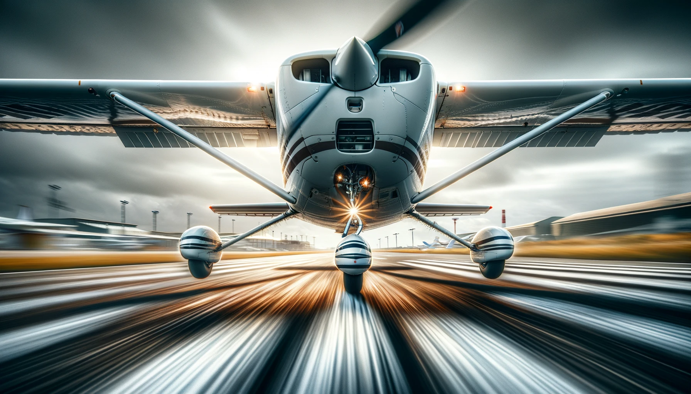

# Cessna 172 Skyhawk

## Skyward Freedom: The Cessna 172 Skyhawk's Journey

Cessna 172 Skyhawk, is an icon of light aviation, renowned for its reliability and versatility. Parked gracefully on an airfield under clear skies, this four-seat, single-engine, high-wing aircraft is a testament to the freedom and opportunities that aviation offers. Its distinctive features, including a spacious cabin and robust wings, are complemented by the scenic landscape that surrounds it, from the blue skies above to the distant mountains that add depth to its setting.

This aircraft is not just a mode of transport; it's a gateway to exploring the world from a new perspective. The ideal lighting conditions highlight its sleek silhouette and the meticulous details of its construction, showcasing the vibrant colors of both the plane and its environment. Designed for both aviation enthusiasts and professionals, the Cessna 172 Skyhawk embodies the spirit of adventure and the joy of flight.

## Sunset Soar: The Cessna 172 Skyhawk in Flight

Captured in a breathtaking moment of flight, the Cessna 172 Skyhawk glides effortlessly against the backdrop of a stunning sunset. This image embodies the essence of aviation - freedom, adventure, and the sheer beauty of flying. As the sun dips below the horizon, casting a spectrum of warm hues across the sky, the Skyhawk is silhouetted in a dance of shadows and light, showcasing its sleek design and the aerodynamic grace that has made it a favorite among pilots and aviation enthusiasts alike.

In this serene yet dynamic scene, the Cessna 172 Skyhawk is not just an aircraft; it's a symbol of exploration and the boundless opportunities that the sky offers. The contrasting colors of the sunset accentuate the aircraft's contours, highlighting its robust construction and the meticulous engineering that enables it to soar. This image captures a moment of tranquility and exhilaration, a testament to the timeless allure of flight and the enduring legacy of the Cessna 172 Skyhawk.

## Flight Among Giants: A Snapshot of Adventure

This image captures the Cessna 172 Skyhawk flying over snowy mountain peaks, illustrating the intersection of human innovation and natural grandeur. The photograph highlights the aircraft's journey against the backdrop of the vast, untouched wilderness, emphasizing the scale and beauty of the landscape. Technical considerations, including altitude, lighting, and weather, were crucial in achieving the clarity and detail seen here. The scene conveys a sense of tranquility and the expansive solitude of high-altitude environments, reflecting on the relationship between humanity and the natural world.

## Liftoff: The Graceful Ascent of a Cessna 172 Skyhawk

Capturing the Cessna 172 Skyhawk at the precise moment of takeoff was an exhilarating experience. This shot, taken from a unique angle that highlights the plane's undercarriage and its graceful separation from the runway, showcases the sheer force and beauty of flight. The lighting was just right, casting detailed shadows that emphasize the aircraft's design and the physics at play. It's moments like these that remind me of the incredible engineering behind these machines and the freedom they represent.

## Elevated Majesty: A Serene View from the Sky

From thousands of feet above, this photograph captures the essence of flight and the beauty of the earth's tapestry as seen from the cockpit of a light aircraft. The early morning light casts a soft glow over the landscape, revealing the intricate patterns of fields and rivers below. The vastness of the scene and the seamless horizon where sky meets land evoke a profound sense of tranquility and awe. This image is a reminder of the unique perspective afforded by flight, offering a moment of serene majesty amidst the hustle of the world below.
