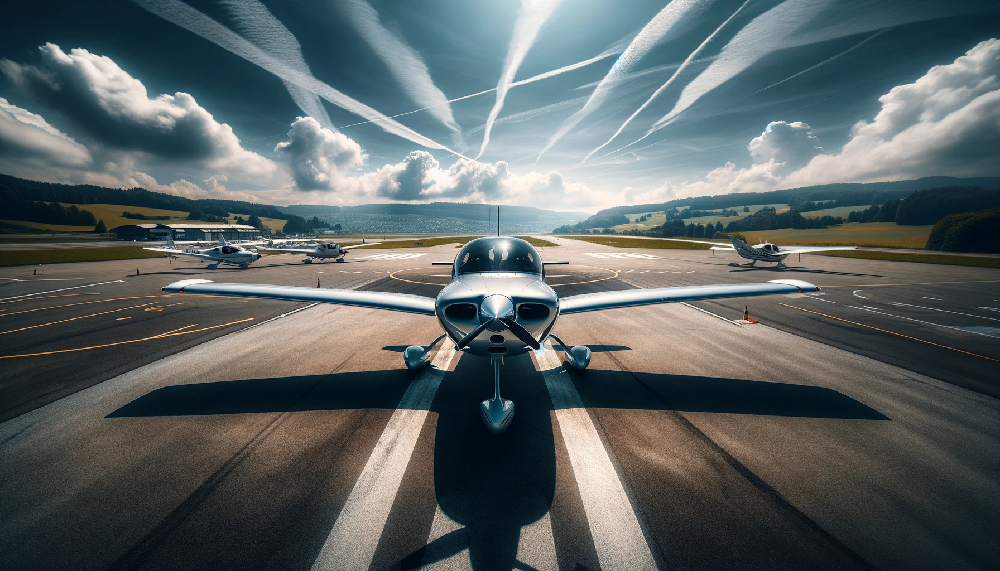
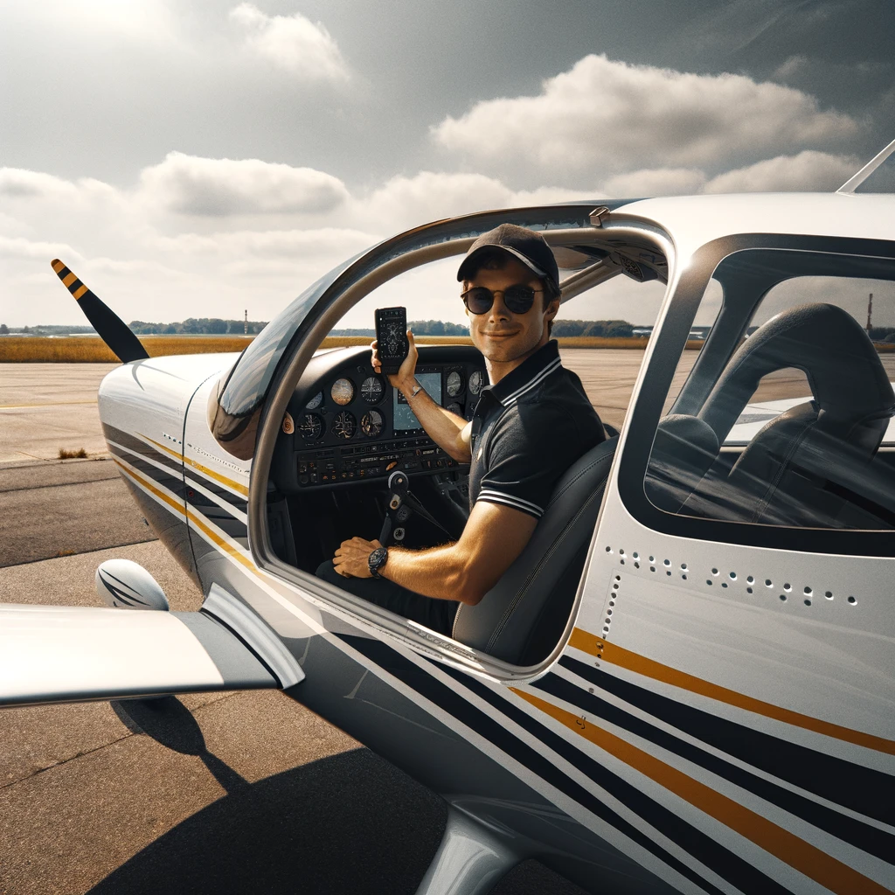

# Cirrus SR22

## Serenity at the Runway: A Cirrus SR22 Awaits Adventure

From the lens of a photographer, capturing the Cirrus SR22 in its natural habitat was an exercise in appreciating the blend of technology and design. Positioned on the airfield, the aircraft stood out against the backdrop of clear blue skies, its sleek lines and unique features illuminated by the bright sunlight. The challenge was to not only highlight the aircraft's design but also to encapsulate the essence of aviation—freedom, precision, and adventure. The surrounding terrain, marked by the precise geometry of the runway and the distant, serene landscape, added depth to the composition, inviting the viewer to contemplate the journey ahead. The shadows cast by the midday sun emphasized the aircraft's form, creating a sense of both momentary stillness and the potential for flight.

## Ascension at Dawn: The Elegance of Takeoff

The thrill of capturing the Cirrus SR22 at the precise moment of takeoff was unparalleled. The challenge lay in freezing that fleeting second when the aircraft transitioned from earthbound to airborne, its wheels barely skimming the runway. The side view offered a spectacular showcase of the aircraft's graceful lines in motion, accentuated by the early morning light that cast a soft, golden hue over the scene. The air distortion from the engine's power added a raw intensity to the image, while the runway markings and the distant airport infrastructure provided a sense of place and context. This photograph was not just about the aircraft; it was a celebration of flight itself, encapsulating the anticipation and exhilaration of the journey ahead.

## Welcoming Skies: Greetings from the Cirrus SR22

Under the expanse of a clear azure sky, a lone Cirrus SR22 stands gracefully on the tarmac. Its door ajar, the aircraft becomes an invitation to the skies. Captured from outside, the photograph frames a moment of connection between pilot and viewer. A casual wave from the figure in the cockpit, clad in a dark polo, sunglasses, and a cap, conveys a sense of camaraderie and ease. The white fuselage, adorned with a stripe of yellow and dark hues, gleams in the sunlight, echoing the brightness of the day. The airfield stretches out, open and inviting, with the promise of the horizon beckoning to those with the spirit to explore. This is more than a mere greeting; it's an overture to adventure in the vast blue yonder.
