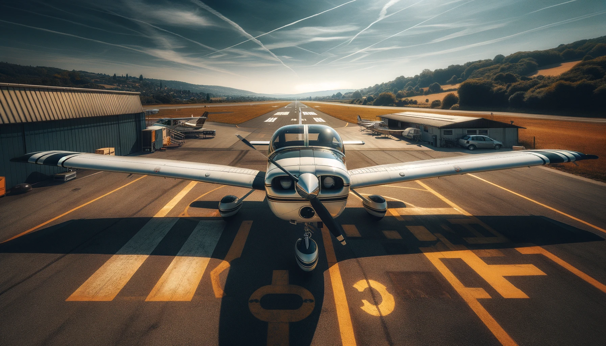
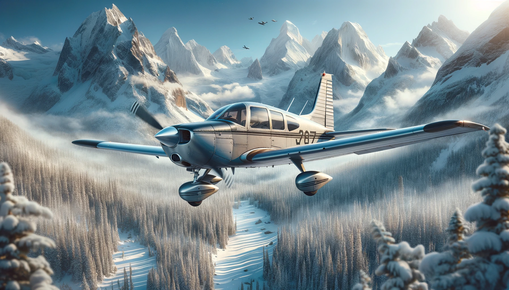
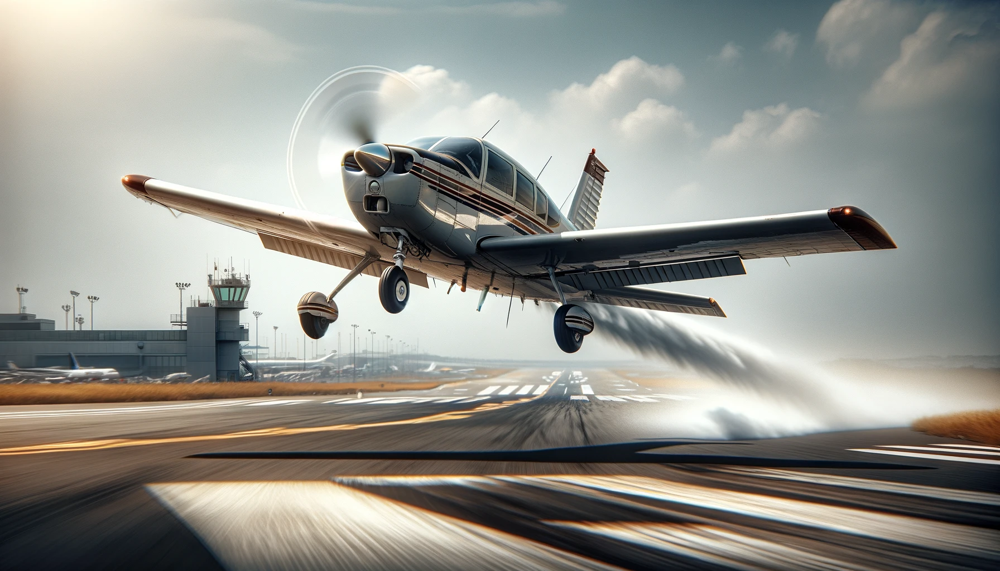

# Piper PA-28 Cherokee

## Dawn of Flight: The Cherokee's Silent Call to the Skies

Capturing the Piper PA-28 Cherokee at rest on the airfield was a moment of pure serenity. The wide-angle lens allowed me to encompass the aircraft in its entirety, set against the backdrop of a crystal-clear sky. The Cherokee, with its sleek design and poised stance, seemed almost eager for the next journey. The surrounding airfield, dotted with runway markings and distant hangars, added a sense of place and purpose, highlighting the aircraft's role in the broader tapestry of aviation.

The morning light bathed the scene in a soft glow, accentuating the contours of the Cherokee and casting long, gentle shadows across the tarmac. This interplay of light and shadow brought out the textures of the plane and the ground, adding depth and dimension to the composition. It was a scene that spoke of potential - the quiet before the day's adventures.

This photograph is more than just an image; it's an invitation to explore, to soar above the mundane, and to discover the freedom that flight offers. The Piper PA-28 Cherokee, solitary but spirited, stands as a symbol of the possibilities that lie in the open skies.

## Soaring Spirit: The Cherokee's Dance with the Mountains

In the stillness of the alpine altitude, I captured the Piper PA-28 Cherokee as it cruised above a pristine snowy forest, its flight path a solitary trace across the vast, untouched canvas of nature. The aircraft, small against the grandeur of the towering peaks, was a testament to humanity's desire to explore and connect with the remote corners of the world. The sunlight, diffused by the crisp mountain air, cast the Cherokee in a glow that echoed the adventurous spirit, while the snow-clad trees below whispered tales of the wild, undisturbed by time.

This photograph is more than just an image; it's a narrative of the synergy between man-made marvels and the raw elegance of the wild. It's a freeze-frame of adventure, a reminder of the places on this earth that remain untamed and free.

## Ascension: The Cherokee's Skyward Sprint

As the propeller blurs into motion and the runway falls away, I captured the Piper PA-28 Cherokee seizing the sky. This photograph, taken from the side, freezes the decisive moment of takeoff, where the power of human engineering triumphs over gravity. The Cherokee, in its ascent, is the embodiment of aspiration and capability, its form sharp against the airstrip, with heat from the exhaust distorting the air behind it. Every detail, from the tread of the tires to the gleam of the metal, speaks to the meticulousness of flight and the thrilling boundary between earth and heaven.

The airfield setting, with its precise markings and distant control towers, frames the Cherokee's climb, underscoring the intersection of human intent and the wild yonder. This image is a tribute to the moment of departure, to the instant a journey begins.
