# WindingTree Market Protocol MVP Architecture

## Introduction

### Purpose

This document aims to provide a comprehensive architectural overview of the WindingTree Market Protocol MVP. It outlines the project's structure and design principles, offering insights into its components, workflows, and interactions. Serving as a guide, it enables developers, stakeholders, and contributors to effectively understand and participate in the development process.

### Scope

The document encompasses the architectural design of the WindingTree Market Protocol MVP, detailing major components such as Smart Contracts, Supplier Node, Coordination Server, and the Supplier and Customer Dapps. It explicates the technical stack, modules, use cases, implementation strategies, and deployment plans, clarifying the system components' interactions, responsibilities, and integration within the project's broader context.

### Definitions

- **MVP (Minimum Viable Product):** The initial release of the WindingTree Market Protocol implementation, equipped with essential features to showcase its utility.
- **Smart Contracts:** Executable contracts on an EVM-based blockchain, facilitating the WindingTree Market Protocol's operations.
- **Supplier Node:** A backend entity managing supplier-related functionalities and interfacing with the blockchain.
- **Coordination Server:** A central hub that orchestrates communication among different protocol entities.
- **Dapp (Decentralized Application):** A frontend application engaging with blockchain systems.
- **Ethereum:** The decentralized blockchain platform utilized in this project.
- **Node.js:** The JavaScript runtime for building server-side applications.
- **React:** A library for crafting user interfaces in JavaScript.
- **Solidity:** The programming language for developing smart contracts on Ethereum.
- **TypeScript:** A statically typed superset of JavaScript for application coding.
- **LevelDB:** A lightweight database for data storage in the MVP.

## Modules/Components

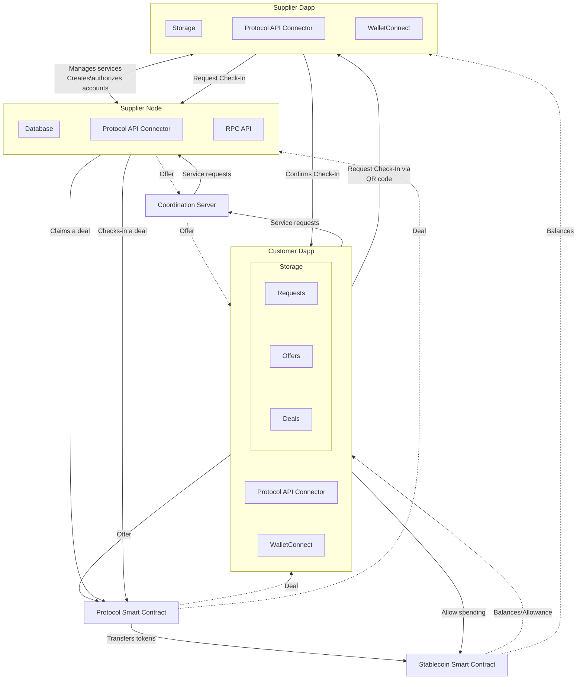
```mermaid
flowchart TB
  subgraph customer[Customer Dapp]
    direction TB
    subgraph c_storage[Storage]
      direction TB
      Requests ~~~
      Offers ~~~
      Deals
    end
    c_api[Protocol API Connector]
    c_wallet[WalletConnect]

    c_storage ~~~ c_api ~~~ c_wallet
  end

  server[Coordination Server]
  contract[Protocol Smart Contract]
  coin[Stablecoin Smart Contract]

  subgraph node[Supplier Node]
    direction LR
    subgraph n_db[Database]
    end
    n_api[Protocol API Connector]
    n_rpc[RPC API]

    n_db ~~~ n_api ~~~ n_rpc
  end

  subgraph manager[Supplier Dapp]
    direction LR
    subgraph m_storage[Storage]
      direction TB
    end
    m_api[Protocol API Connector]
    m_wallet[WalletConnect]

    m_storage ~~~ m_api ~~~ m_wallet
  end

  %% Request flow
  customer -- Service requests --> server
  server -- Service requests --> node

  %% Offer flow
  node -. Offer .-> server
  server -. Offer .-> customer

  %% Deal flow
  coin -. Balances/Allowance .-> customer
  customer -- Allow spending --> coin
  contract -- Transfers tokens --> coin
  customer -- Offer --> contract
  contract -. Deal .-> customer
  contract -. Deal .-> node

  %% Deal claim flow
  node -- Claims a deal --> contract

  %% Node manager flow
  manager <-- Manages services\nCreates\authorizes accounts --> node
  coin -. Balances .-> manager

  %% Check-In flow
  customer -- Request Check-In via\nQR code --> manager
  manager -- Request Check-In  --> node
  node -- Checks-in a deal --> contract
  manager -- Confirms Check-In --> customer
```

## Supplier Use-Cases

### Supplier Registration

During this process, suppliers are required to configure their Node with specific parameters provided as environment variables.

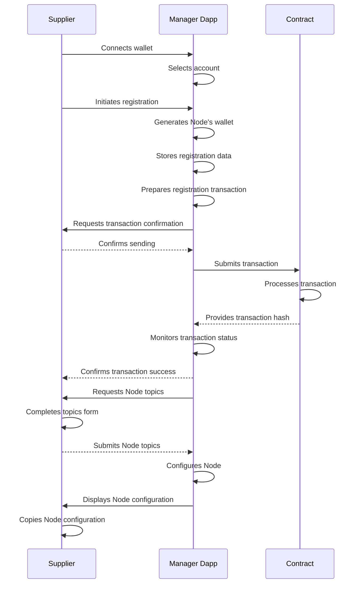
```mermaid
sequenceDiagram
  participant supplier as Supplier
  participant manager as Manager Dapp
  participant contract as Contract

  supplier->>manager: Connects wallet
  manager->>manager: Selects account
  supplier->>manager: Initiates registration
  manager->>manager: Generates Node's wallet
  manager->>manager: Stores registration data
  manager->>manager: Prepares registration transaction
  manager->>supplier: Requests transaction confirmation
  supplier-->>manager: Confirms sending
  manager->>contract: Submits transaction
  contract->>contract: Processes transaction
  contract-->>manager: Provides transaction hash
  manager->>manager: Monitors transaction status
  manager-->>supplier: Confirms transaction success
  manager->>supplier: Requests Node topics
  supplier->>supplier: Completes topics form
  supplier-->>manager: Submits Node topics
  manager->>manager: Configures Node
  manager->>supplier: Displays Node configuration
  supplier->>supplier: Copies Node configuration
```

### Supplier Node Configuration

Node configuration parameters are generated during the `Supplier Registration` process.

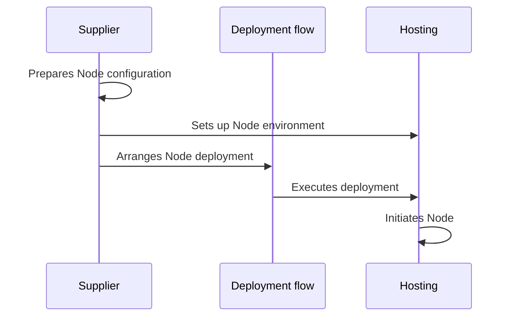
```mermaid
sequenceDiagram
  participant supplier as Supplier
  participant node as Deployment flow
  participant host as Hosting

  supplier->>supplier: Prepares Node configuration
  supplier->>host: Sets up Node environment
  supplier->>node: Arranges Node deployment
  node->>host: Executes deployment
  host->>host: Initiates Node
```

### Administrative Log-In

To access the Node Manager Dapp features, suppliers must log in using the wallet associated with the registration transaction.

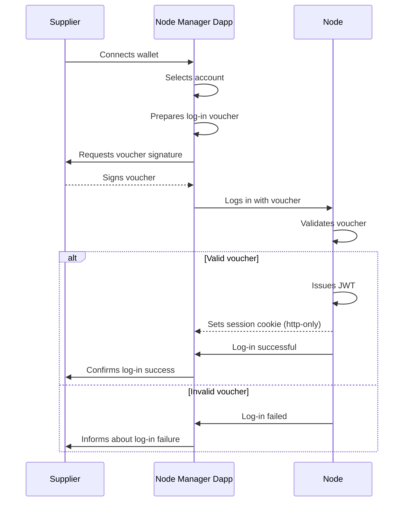
```mermaid
sequenceDiagram
  participant supplier as Supplier
  participant manager as Node Manager Dapp
  participant node as Node

  supplier->>manager: Connects wallet
  manager->>manager: Selects account
  manager->>manager: Prepares log-in voucher
  manager->>supplier: Requests voucher signature
  supplier-->>manager: Signs voucher
  manager->>node: Logs in with voucher
  node->>node: Validates voucher

  alt Valid voucher
    node->>node: Issues JWT
    node-->>manager: Sets session cookie (http-only)
    node->>manager: Log-in successful
    manager->>supplier: Confirms log-in success
  else Invalid voucher
    node->>manager: Log-in failed
    manager->>supplier: Informs about log-in failure
  end
```

### User Accounts Management

The Node Manager Dapp's user accounts are managed by suppliers for employees facilitating customer interactions and check-ins.

#### User Account Registration

Suppliers create accounts for employees using the following flow:

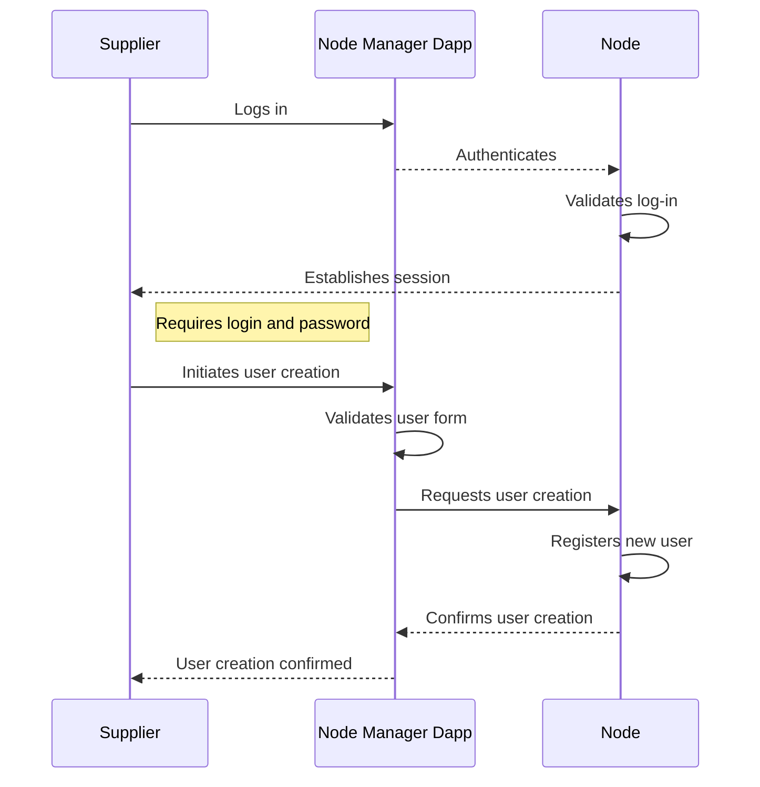
```mermaid
sequenceDiagram
  participant supplier as Supplier
  participant manager as Node Manager Dapp
  participant node as Node

  supplier->>manager: Logs in
  manager-->>node: Authenticates
  node->>node: Validates log-in
  node-->>supplier: Establishes session
  Note left of manager: Requires login and password
  supplier->>manager: Initiates user creation
  manager->>manager: Validates user form
  manager->>node: Requests user creation
  node->>node: Registers new user
  node-->>manager: Confirms user creation
  manager-->>supplier: User creation confirmed
```

#### User Account Log In

The log-in process for user accounts is as follows:

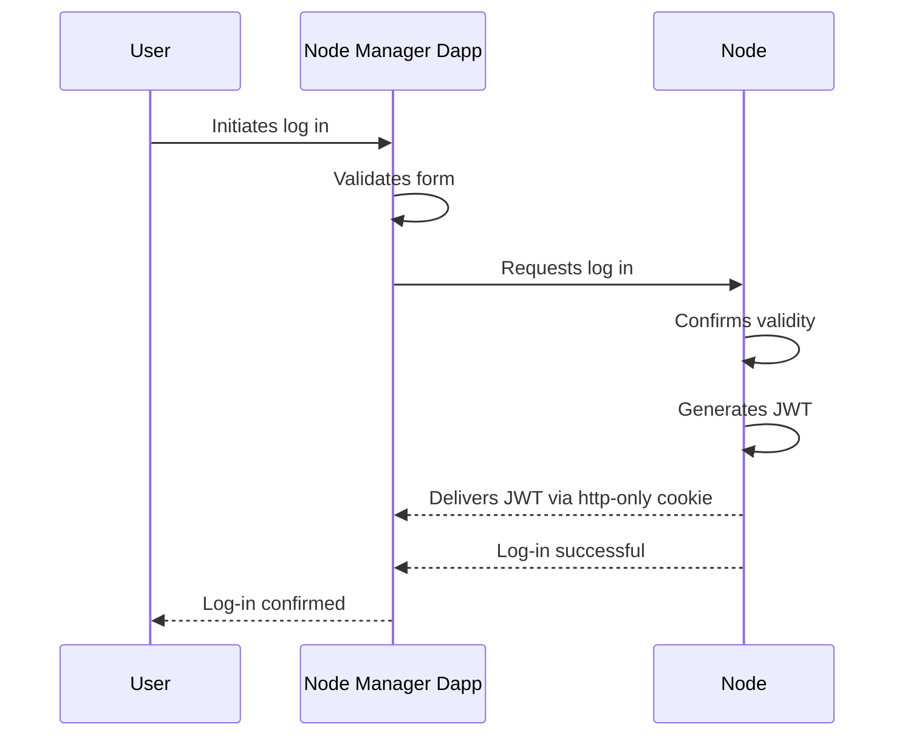
```mermaid
sequenceDiagram
  participant user as User
  participant manager as Node Manager Dapp
  participant node as Node

  user->>manager: Initiates log in
  manager->>manager: Validates form
  manager->>node: Requests log in
  node->>node: Confirms validity
  node->>node: Generates JWT
  node-->>manager: Delivers JWT via http-only cookie
  node-->>manager: Log-in successful
  manager-->>user: Log-in confirmed
```

#### User Account Password Change

Users can change their account passwords using the following method:

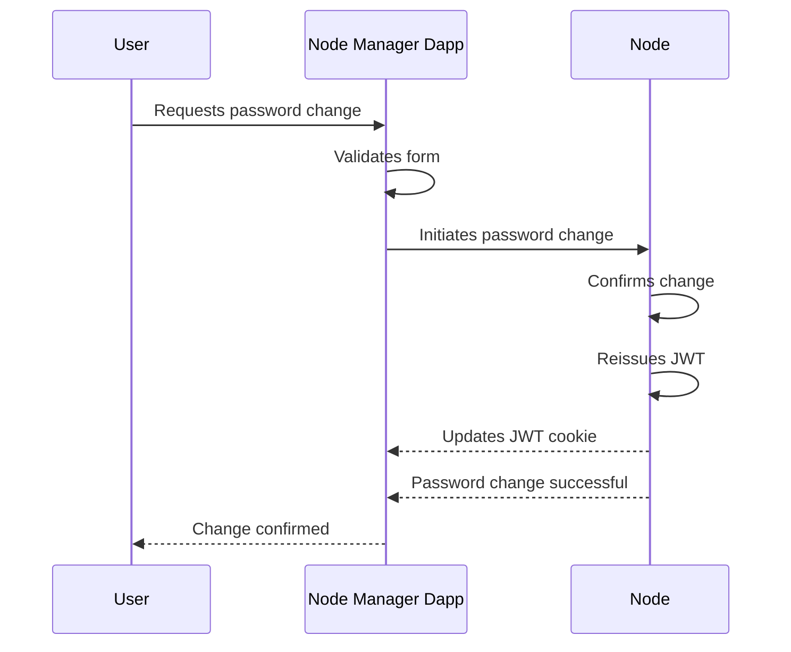
```mermaid
sequenceDiagram
  participant user as User
  participant manager as Node Manager Dapp
  participant node as Node

  user->>manager: Requests password change
  manager->>manager: Validates form
  manager->>node: Initiates password change
  node->>node: Confirms change
  node->>node: Reissues JWT
  node-->>manager: Updates JWT cookie
  node-->>manager: Password change successful
  manager-->>user: Change confirmed
```

### Service Items Management

Service items refer to the offerings suppliers provide to customers. This MVP includes a simplified flight booking workflow.

#### Service Items Parameters

Each service item includes:

- ID
- Name/Type (e.g., airplane type, balloon)
- Description
- Image list
- Passenger capacity
- Duration (hours)

And attributes:

- Date
- Price per hour

#### Property (Airplanes) Management

Managing service items involves creation or update processes as follows:

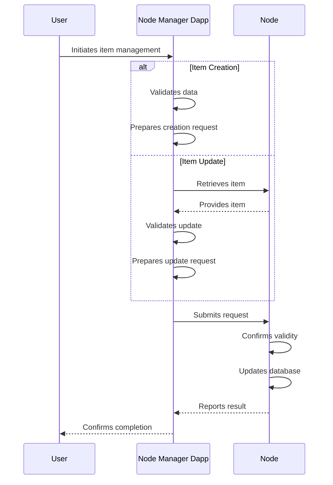
```mermaid
sequenceDiagram
  participant user as User
  participant manager as Node Manager Dapp
  participant node as Node

  user->>manager: Initiates item management

  alt Item Creation
    manager->>manager: Validates data
    manager->>manager: Prepares creation request
  else Item Update
    manager->>node: Retrieves item
    node-->>manager: Provides item
    manager->>manager: Validates update
    manager->>manager: Prepares update request
  end

  manager->>node: Submits request
  node->>node: Confirms validity
  node->>node: Updates database
  node-->>manager: Reports result
  manager-->>user: Confirms completion
```

#### Booking Management

Booking involves offer creation, deal claiming, and check-in processes. Overbooking and refunds are beyond the MVP scope.

- Offers creation
- Claiming of deals
- Overbooking management (_not included in the MVP scope_)
- Check-In
- Refund management (_not included in the MVP scope_)
- CheckOut

> Assuming that queries from customers and offers from suppliers are reaching each other via the protocol way and can be omitted on diagrams. On diagrams, such messages will be defined as direct connections.

> Note: Overbooking is a situation when two or more customers are made a "Deal" for the same offer. The current implementation of the protocol smart contract is not allowed to make two or more Deals on the same offer. Overbooking is mentioned as a potential feature that can be enabled in future, as it, in theory, can solve the scalability issue on the supplier's node side when the supplier wants to trade unlimited service items.

Here's the offer creation flow:

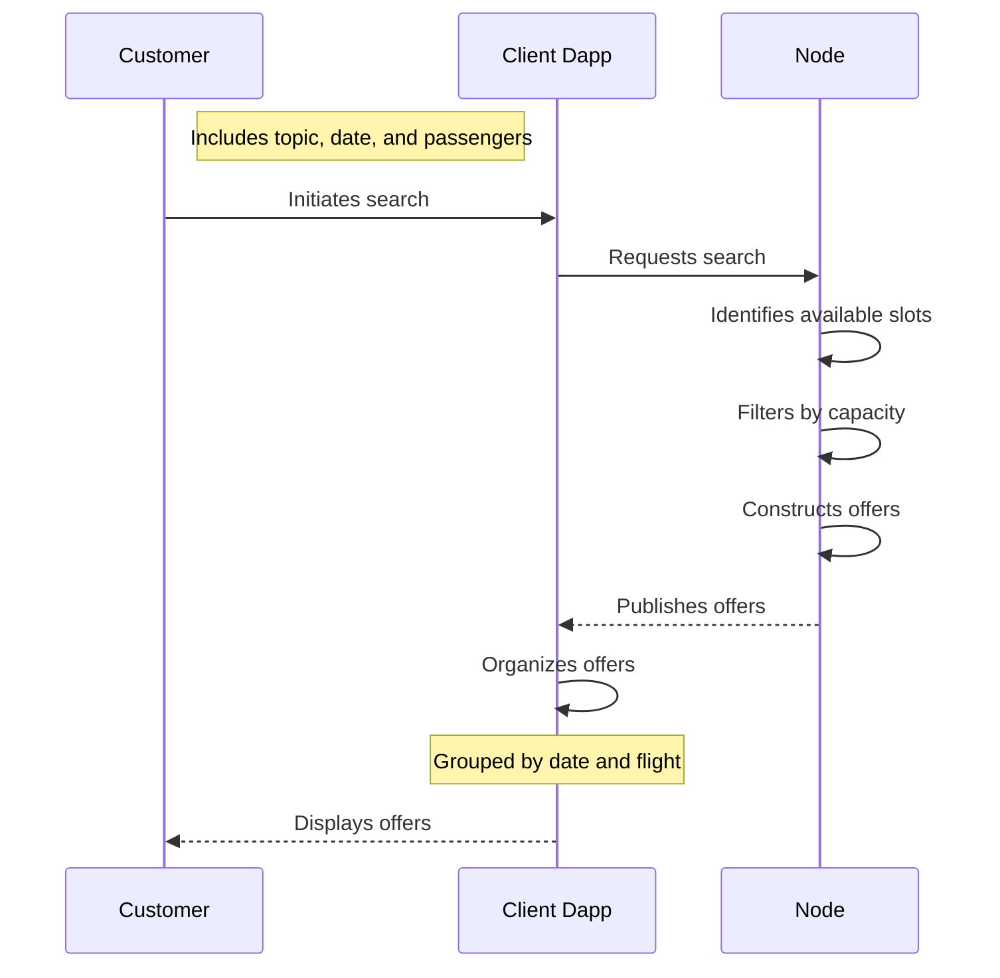
```mermaid
sequenceDiagram
  participant customer as Customer
  participant client as Client Dapp
  participant node as Node

  Note left of client: Includes topic, date, and passengers
  customer->>client: Initiates search
  client->>node: Requests search
  node->>node: Identifies available slots
  node->>node: Filters by capacity
  node->>node: Constructs offers
  node-->>client: Publishes offers
  client->>client: Organizes offers
  Note over client: Grouped by date and flight
  client-->>customer: Displays offers
```

> Deals creation is described [below](#payment-for-offer)

Here's the deals claiming flow:

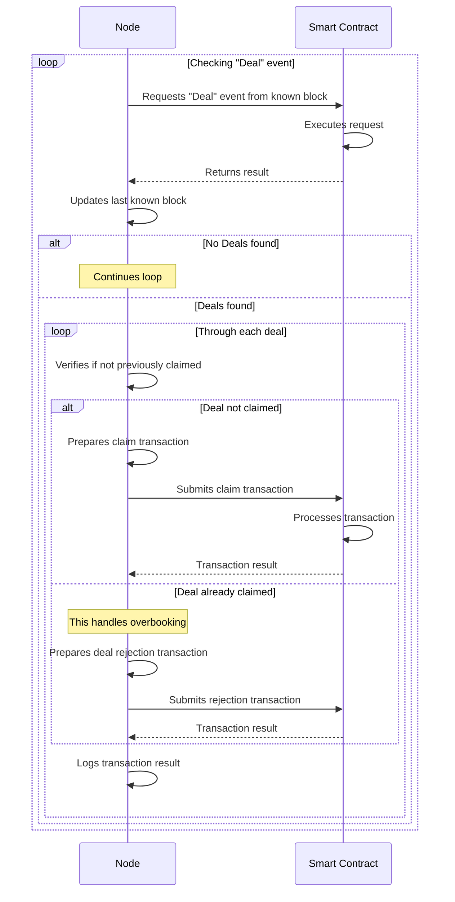
```mermaid
sequenceDiagram
  participant node as Node
  participant contract as Smart Contract

  loop Checking "Deal" event
    node->>contract: Requests "Deal" event from known block
    contract->>contract: Executes request
    contract-->>node: Returns result
    node->>node: Updates last known block

    alt No Deals found
      Note over node: Continues loop
    else Deals found
      loop Through each deal
        node->>node: Verifies if not previously claimed
        alt Deal not claimed
          node->>node: Prepares claim transaction
          node->>contract: Submits claim transaction
          contract->>contract: Processes transaction
          contract-->>node: Transaction result
        else Deal already claimed
          Note over node: This handles overbooking
          node->>node: Prepares deal rejection transaction
          node->>contract: Submits rejection transaction
          contract-->>node: Transaction result
        end
        node->>node: Logs transaction result
      end
    end
  end
```

Here's the deal refund flow:

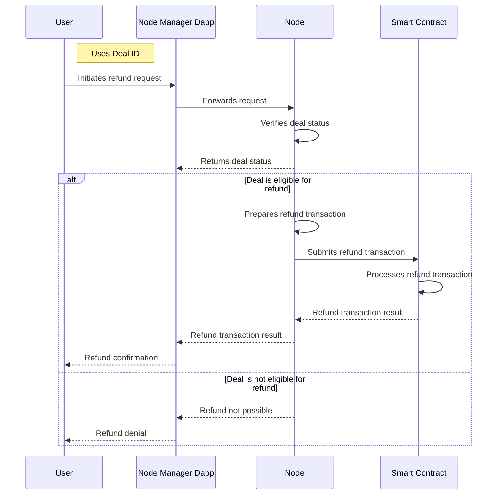
```mermaid
sequenceDiagram
  participant user as User
  participant manager as Node Manager Dapp
  participant node as Node
  participant contract as Smart Contract

  Note right of user: Uses Deal ID
  user->>manager: Initiates refund request
  manager->>node: Forwards request
  node->>node: Verifies deal status
  node-->>manager: Returns deal status

  alt Deal is eligible for refund
    node->>node: Prepares refund transaction
    node->>contract: Submits refund transaction
    contract->>contract: Processes refund transaction
    contract-->>node: Refund transaction result
    node-->>manager: Refund transaction result
    manager-->>user: Refund confirmation
  else Deal is not eligible for refund
    node-->>manager: Refund not possible
    manager-->>user: Refund denial
  end
```

Here's the Check-In flow:

> The customer is able to create a check-in QR code and download it before visiting the supplier's reception. This way, the customer will display QR from his device without access to his crypto wallet.

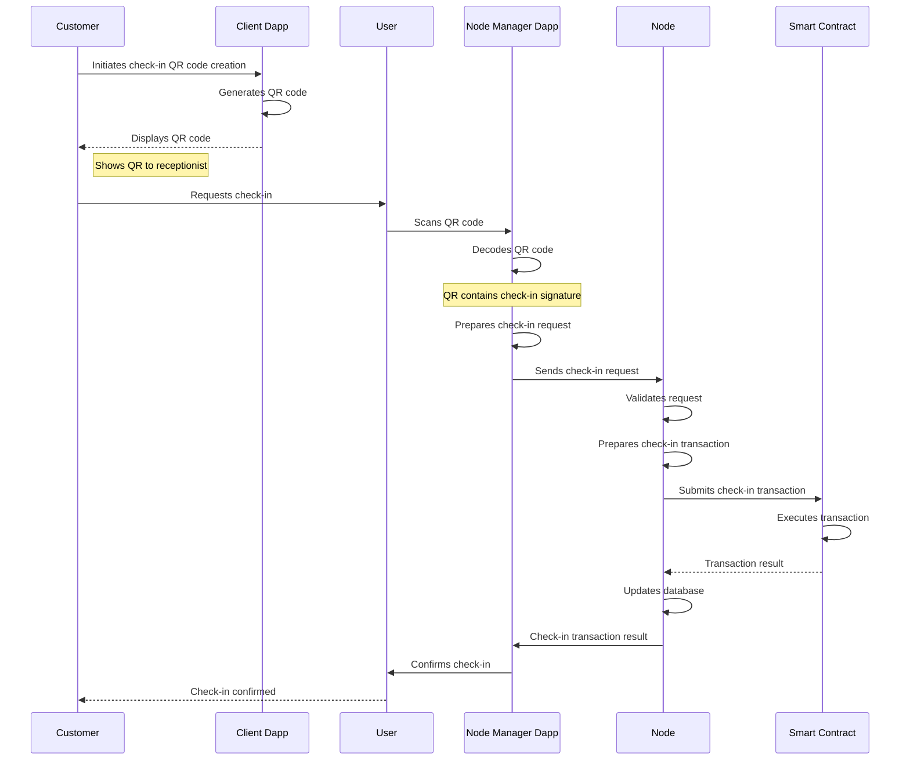
```mermaid
sequenceDiagram
  participant customer as Customer
  participant client as Client Dapp
  participant user as User
  participant manager as Node Manager Dapp
  participant node as Node
  participant contract as Smart Contract

  customer->>client: Initiates check-in QR code creation
  client->>client: Generates QR code
  client-->>customer: Displays QR code
  Note right of customer: Shows QR to receptionist
  customer->>user: Requests check-in
  user->>manager: Scans QR code
  manager->>manager: Decodes QR code
  Note over manager: QR contains check-in signature
  manager->>manager: Prepares check-in request
  manager->>node: Sends check-in request
  node->>node: Validates request
  node->>node: Prepares check-in transaction
  node->>contract: Submits check-in transaction
  contract->>contract: Executes transaction
  contract-->>node: Transaction result
  node->>node: Updates database
  node->>manager: Check-in transaction result
  manager->>user: Confirms check-in
  user-->>customer: Check-in confirmed
```

## Customer-only Use-Cases

### Wallet Connection

This standard "WalletConnect" flow allows customers to link their Metamask wallet (browser extension) or mobile wallet to the application, enhancing security and usability.

### Blockchain Network Selection

The customer Dapp must connect to a blockchain network supported by the Monerium stablecoin provider, including Ethereum, Gnosis, and Polygon. Users are prompted to switch networks if the Dapp is initially connected to an unsupported one, ensuring compatibility and seamless transactions.

### Search Request

Users can locate airports within the customer Dapp via a map or a list. The application uses the airport's geo-location to generate a search request topic, leveraging the H3 geospatial indexing system for precise and efficient query handling. This system enables the matching of customer search requests with supplier nodes based on geographical relevance.

### Payment for Offer

Assuming the Dapp is already connected to the user's wallet, the payment process for an offer is outlined as follows:

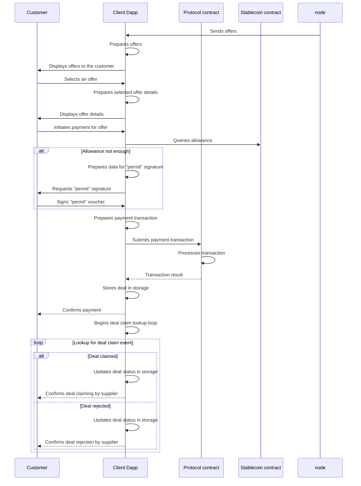
```mermaid
sequenceDiagram
  participant customer as Customer
  participant client as Client Dapp
  participant contract as Protocol contract
  participant coin as Stablecoin contract

  node->>client: Sends offers
  client->>client: Prepares offers
  client->>customer: Displays offers to the customer
  customer->>client: Selects an offer
  client->>client: Prepares selected offer details
  client->>customer: Displays offer details
  customer->>client: Initiates payment for offer
  client->>coin: Queries allowance

  alt Allowance not enough
    client->>client: Prepares data for "permit" signature
    client->>customer: Requests "permit" signature
    customer->>client: Signs "permit" voucher
  end

  client->>client: Prepares payment transaction
  client->>contract: Submits payment transaction
  contract->>contract: Processes transaction
  contract-->>client: Transaction result
  client->>client: Stores deal in storage
  client-->>customer: Confirms payment
  client->>client: Begins deal claim lookup loop

  loop Lookup for deal claim event
    alt Deal claimed
      client->>client: Updates deal status in storage
      client-->>customer: Confirms deal claiming by supplier
    else Deal rejected
      client->>client: Updates deal status in storage
      client-->>customer: Confirms deal rejection by supplier
    end
  end
```

### Deal Cancellation

Deals can be cancelled according to the protocol and specific offer conditions, providing flexibility and control to the customer:

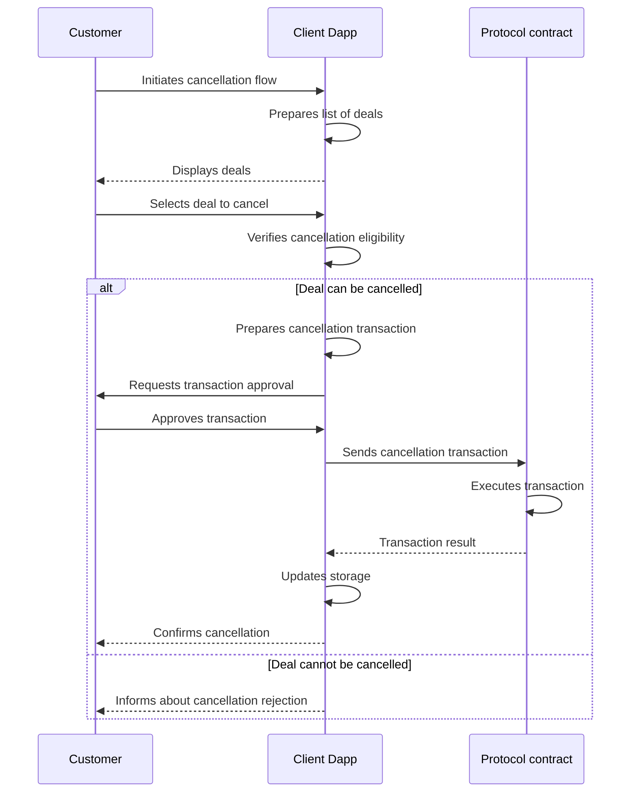
```mermaid
sequenceDiagram
  participant customer as Customer
  participant client as Client Dapp
  participant contract as Protocol contract

  customer->>client: Initiates cancellation flow
  client->>client: Prepares list of deals
  client-->>customer: Displays deals
  customer->>client: Selects deal to cancel
  client->>client: Verifies cancellation eligibility

  alt Deal can be cancelled
    client->>client: Prepares cancellation transaction
    client->>customer: Requests transaction approval
    customer->>client: Approves transaction
    client->>contract: Sends cancellation transaction
    contract->>contract: Executes transaction
    contract-->>client: Transaction result
    client->>client: Updates storage
    client-->>customer: Confirms cancellation
  else Deal cannot be cancelled
    client-->>customer: Informs about cancellation rejection
  end
```

## Implementation

The implementation sequence prioritizes the market protocol and supplier node components, followed by other essential parts of the system.

Here's the list of high-level components in the order of implementation:

- The Market Protocol Smart Contracts
- [Supplier's Node](./spec/node-spec.md)
- [Supplier's Node Manager Dapp](./spec/dapp-supplier-spec.md)
- Coordination Server (specification is not required because the server is fully implemented in the frame of the SDK)
- [Client's Dapp](./spec/dapp-client-spec.md)

### Smart Contracts

Two configurations are outlined for development and live testing, including local Docker setups and deployments on the "Chiado" testnet.

## Deployment

A Linux-based server (Ubuntu Server LTS) with Node.js and Nginx pre-configured is recommended for MVP deployment, accompanied by a semi-automated CI workflow for application deployment:

- Coordination Server (pm2 managed Node.js App)
- Supplier's Node (pm2 managed Node.js App)
- Supplier's Node Manager Dapp (Web App)
- Client Dapp (Web App)

## Errors Logging

Initially, debugging messages and errors will be logged to the system console (logs will be managed by the pm2 log rotation plugin), with further enhancements planned for future iterations.
