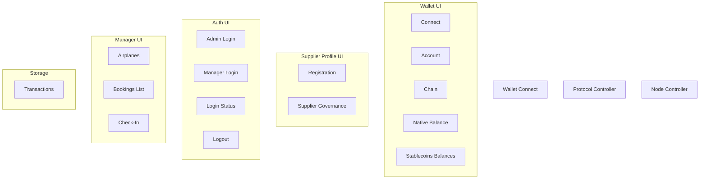
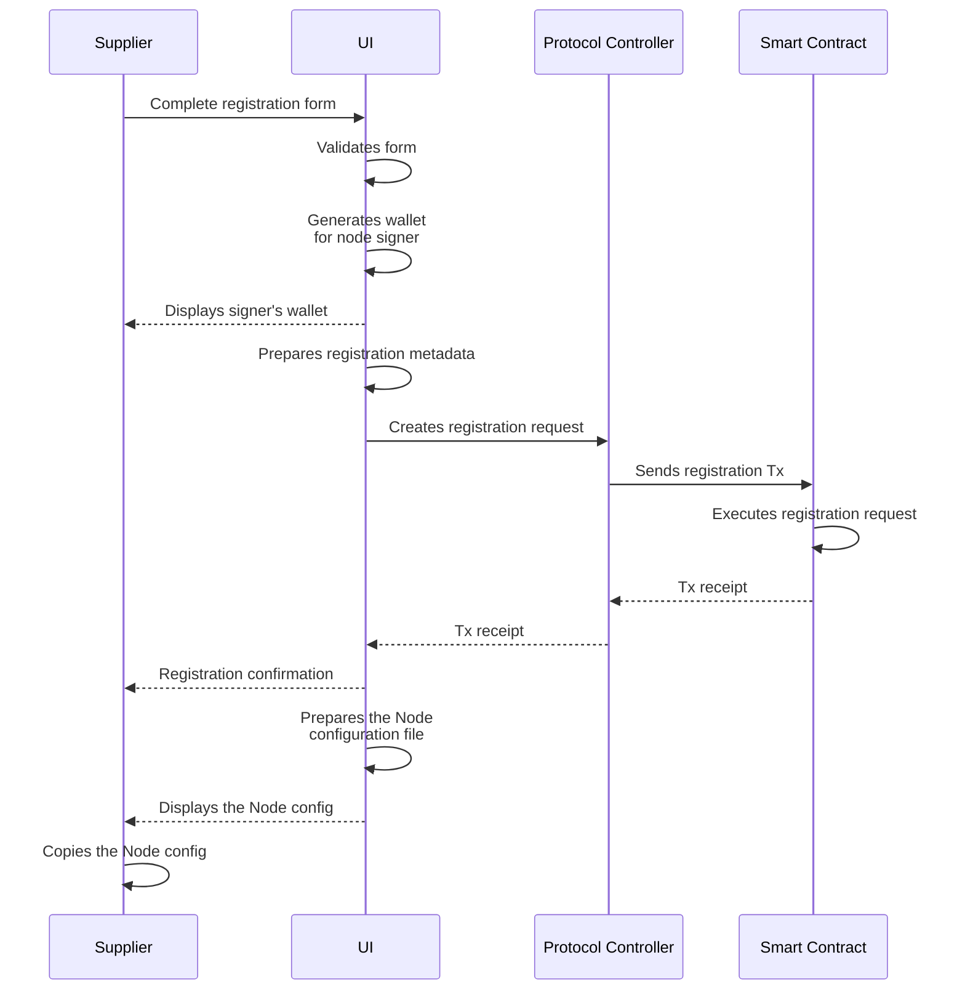
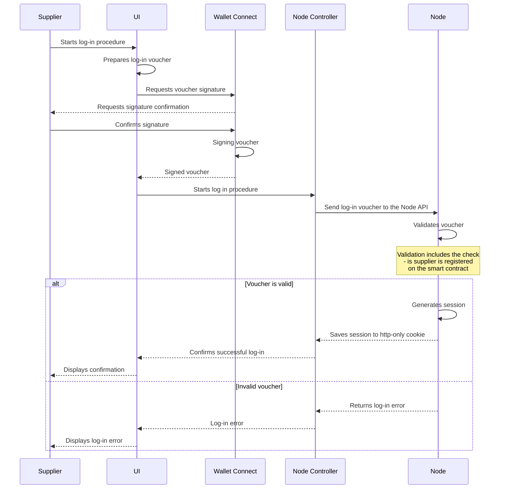
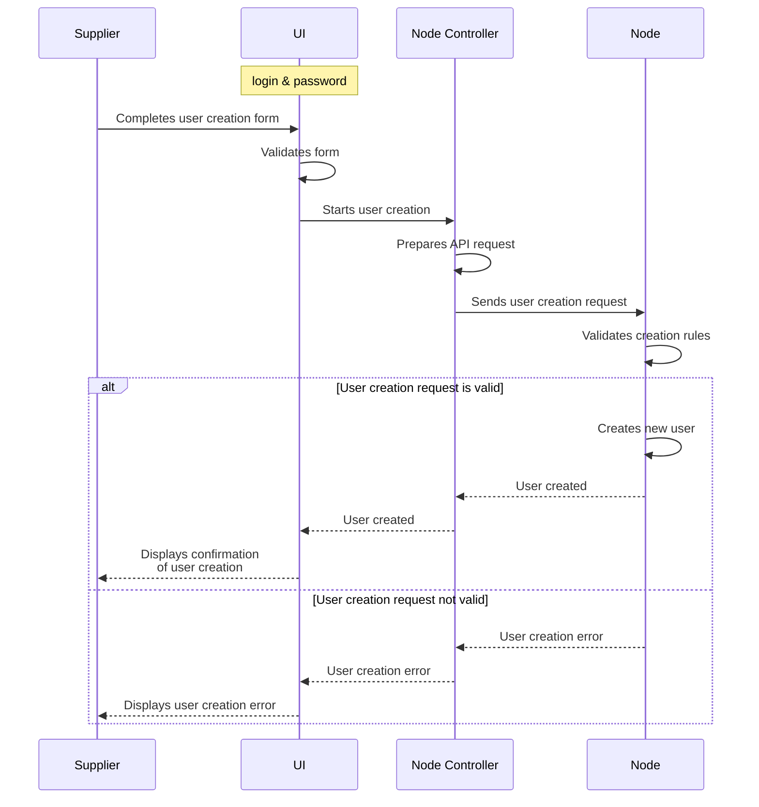
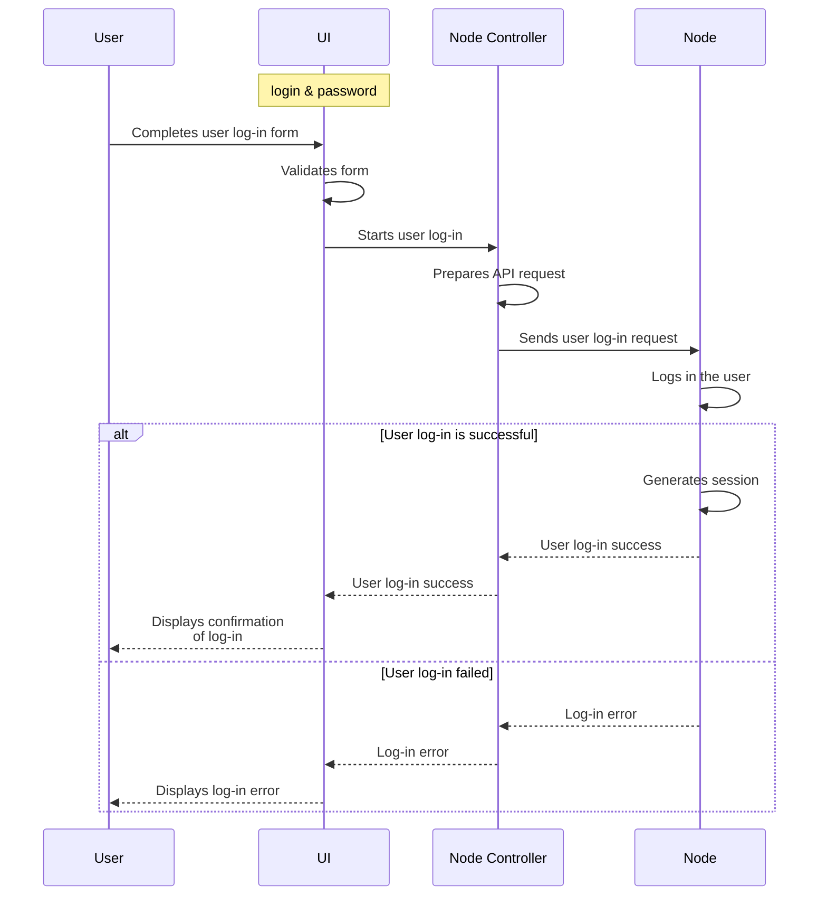

# WindingTree Market Protocol Supplier Dapp Specification

## Overview

### Purpose and Functionality

### Role in WindingTree Ecosystem

### Target Users

## Technical Requirements

### Technology Stack

- Browser (latest 2 versions)
- **Typescript**
- **React.js**
- **tRPC** (external API)
- **viem** (blockchain connectivity)
- `@windingtree/sdk*` packages (protocol features)

## Architecture and Design

### System Architecture

### User Experience

#### Wallet Connection

Connection of in-browser and external wallet must follow the usual and recommended WalletConnect UX.

The application will support only one blockchain network (supported by the protocol). In case of user's wallet is connected to the wrong chain the application must request a switching connection chain to the right one.

When the wallet is connected the application must provide the user with UI that displays a balance of the chain native currency and balances of stablecoins supported by the protocol.

#### Supplier Registration

> Assuming that the supplier has connected his wallet already

#### Supplier Governance

> For using governance features the supplier must connect the wallet used during the entity registration

Here the following features that can be used for the supplier entity governance.

- Tokens deposit and withdrawal
- Changing of the Node signer address
- Toggling of the supplier entity

All these features are transactions to the smart contract, so they are must be implemented as usual.

#### Admin Log-In

> Assuming that the supplier has connected his wallet already

#### Users Creation

> Assuming that the supplier has logged in already

#### User Log-In

> Logged in user is able to change his password. A password changing flow is almost the same as a user creation flow.

#### Log-Out

To log-out the user or supplier are must send the log-out request to the Node.

#### Adding tariffs

Tariffs are configuration parameters dedicated to the calculation of an offer price.

#### Price calculation algorithm

TBD

#### Bookings List

TBD

## Development and Deployment

### Development Guidelines

#### Environment Setup

- **Local Development**: Outline the process of setting up a local development environment, including required software, dependencies, and environment variables.
- **Version Control**: GitHub. Same as for SDK flow (`master` and `develop` branches).

#### Coding Standards

- **Style Guide**: prettier config, the same as in the SDK
- **Code Reviews**: a mandatory code review process to maintain code quality and knowledge sharing among team members.

#### Testing

- **Unit Testing**: Emphasize the importance of writing unit tests for all new code and major refactoring, aiming for high code coverage.
- **Integration Testing**: Detail how to write integration tests to check the interactions between different parts of the application.
- **End-to-End Testing**: Implement end-to-end tests for critical user flows and interactions.

#### Documentation

- **In-Code Documentation**: Encourage thorough in-code documentation for complex logic and critical code sections.
- **External Documentation**:
  - Node manager Dapp Help

### Deployment Process

#### Continuous Integration (CI)

- **Automated Testing**: Set up CI pipelines to run tests on every commit and pull request.
- **Build Process**: Automate the build process to ensure reproducible builds.

#### Deployment Strategy

- **Staging Environment**: Use a staging environment that mirrors production to test changes in a live setting.
- **Rolling Updates**: Implement rolling updates to minimize downtime and allow for rollback in case of issues

> ^^^ Must be discussed

#### Monitoring and Maintenance

- **Logging**: Simple console logging. Must be used `@windingtree/sdk-logger` package

### Security

- **Security Audits**: Conduct regular security audits to identify and mitigate potential vulnerabilities.
  > ^^^ Must be discussed
- **Dependency Management**: Regularly update dependencies to incorporate security patches.
