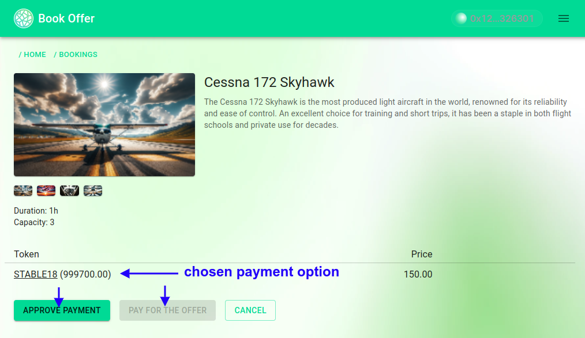

# The Protocol Client's Dapp Use Cases

The Client's Dapp serves as a gateway for end-users to access and interact with the WindingTree Market Protocol, offering a suite of functionalities designed to enhance the user experience. This guide details the various use cases of the Dapp, from browsing tours to generating Check-In vouchers.

## Browsing and Reviewing Available Tours

- The Dapp's homepage showcases a catalogue-like interface, allowing users to browse through available tours and proceed to search for airplanes for booking.

## Requesting and Booking Airplanes for Tours

### Initiating an Airplane Search

- Select the desired date for your tour.
- Initiate the search by clicking the `Search` button.
- The `Search` button may be disabled if:
  - The protocol client has not connected to the coordination server.
  - A date has not been selected.

### Reviewing Booking Offers

- Upon publishing a search request, connected suppliers process the request and generate offers.
- Each offer is captured by the `RequestManager` and displayed in a list within the Dapp, allowing users to review and select an offer for further details.

### Analyzing Offer Details

- The offer details section provides comprehensive information including:
  - The type and name of the airplane.
  - A detailed description and image gallery of the airplane.
  - Airplane capacity and offered flight duration.
  - Various payment options listed in stablecoins, each displaying the coin symbol, user's balance, and the booking price.
- To proceed with booking, select the `Book` button corresponding to your preferred payment option.

## Managing Booking Processes

### Initiating Booking

- Upon choosing a price option, confirm the payment by clicking `Approve Payment`. This might be disabled if you've already approved the required stablecoin amount for the protocol.
- Confirming `Approve Payment` prompts a MetaMask dialogue for transaction approval, followed by the transaction itself.
- After payment approval, finalize the booking by clicking `Pay for the offer`.

> Note: The MVP currently does not implement `permit`-based approvals, with plans for future integration.

### Confirming Booking Success

- A confirmation message displays once the payment transaction is processed, indicating successful booking.
- Users can then navigate to the bookings page or return to the homepage.

## Generating Check-In Vouchers

- Check-In voucher generation requires wallet connection via Web3Modal.
- The `Show Checkin Voucher` button becomes visible once the wallet is connected.
- If the wallet account differs from the deal owner, a warning message prompts the user to switch accounts in MetaMask.
- Confirming the voucher signature in MetaMask reveals the Check-In voucher QR code.
- The QR code can be downloaded and saved on your device, eliminating the need for wallet access during the supplier's reception check-in process.

This guide underscores the Client's Dapp's multifaceted use cases, from exploring available tours to securely managing bookings and generating check-in vouchers, thereby streamlining the end-user experience within the WindingTree Market Protocol ecosystem.
