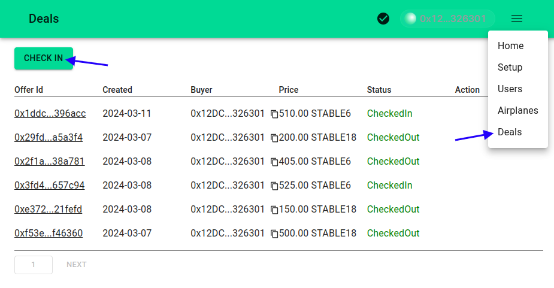
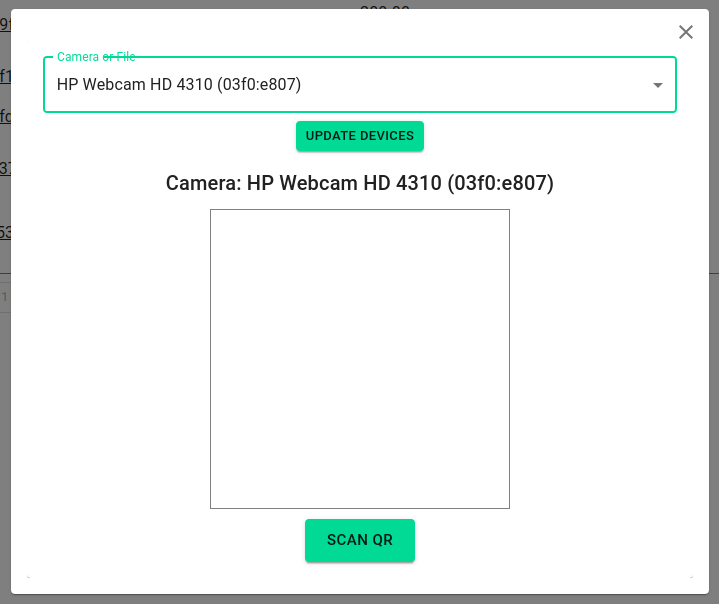
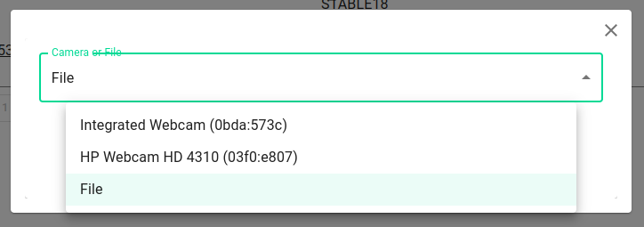
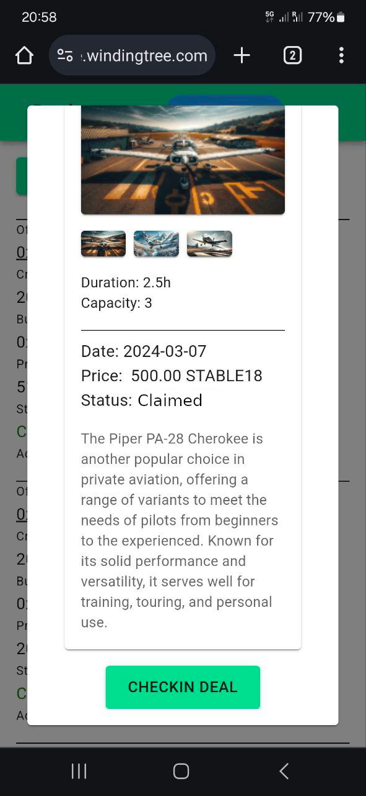

# Check-In Procedure in the Supplier's Dapp

The check-in procedure is a crucial component of managing deals in the Supplier's Node Management Dapp. It provides a streamlined process for verifying and updating the status of deals, specifically designed for managers. Here's how to navigate this process effectively.

## Initiating the Check-In Process

> Ensure you're logged in as a manager to access the required functionalities.

1. Navigate to the `Deals Page` by selecting the `Deals` option from the main menu. This page lists all the current deals associated with the supplier.
2. Initiate the check-in procedure by clicking on the `Check In` button next to the relevant deal.

## Choosing Check-In Scan Options

The Dapp offers two convenient options for scanning the QR code associated with a deal:

### Scanning QR Code with Camera

Leverage either the device's front or rear camera to scan the QR code directly.

### Scanning QR Code from File

If you have a QR code saved as an image file, you can upload it directly for scanning.

## Completing the Check-In

Once the QR code is successfully scanned and the corresponding deal is identified, the manager can finalize the check-in process.

1. A confirmation screen will display the deal details, verifying that the correct deal has been scanned.
2. To complete the check-in, press the `CheckIn Deal` button. This action updates the deal's status in the system.

> Note: The check-in functionality is specifically designed for deals in the `Claimed` status. This ensures that only valid, pre-authorized deals proceed to the check-in stage, maintaining the integrity of the transaction lifecycle.

This guide outlines the essential steps for conducting the check-in procedure within the Supplier's Node Management Dapp, ensuring managers can efficiently process deals. The dual QR code scanning options enhance flexibility, accommodating various operational scenarios and device capabilities.
