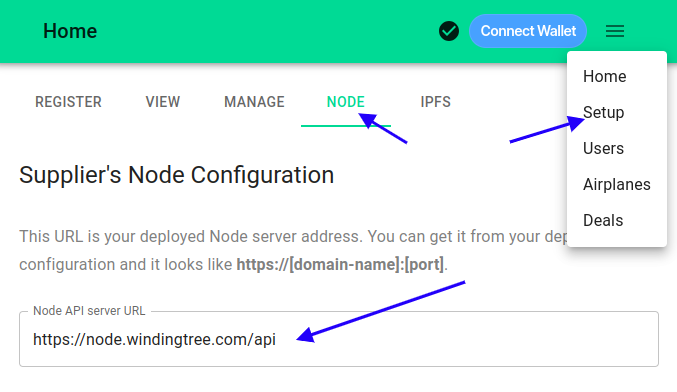
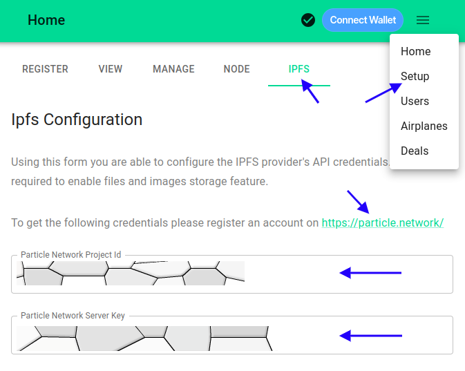
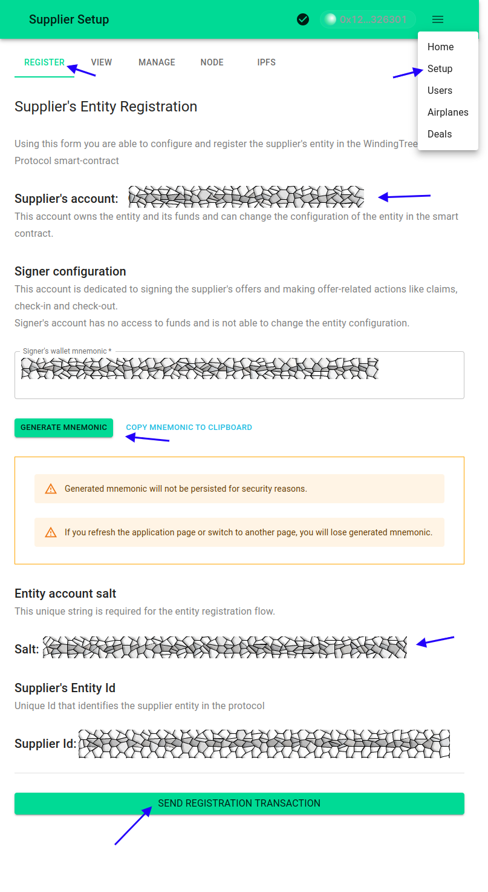
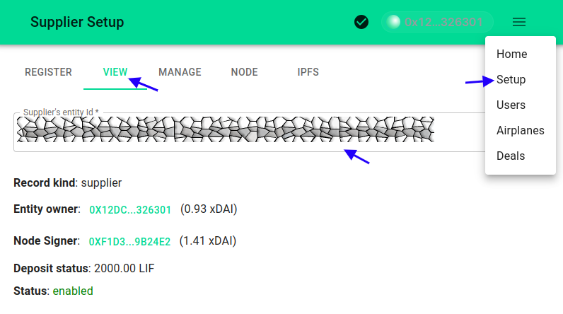
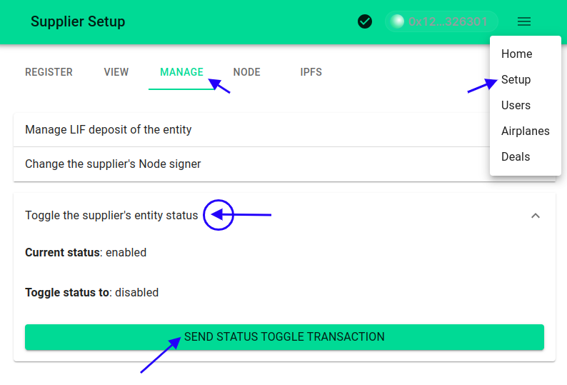
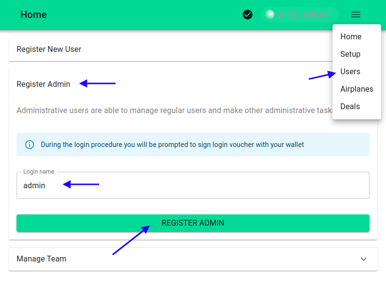
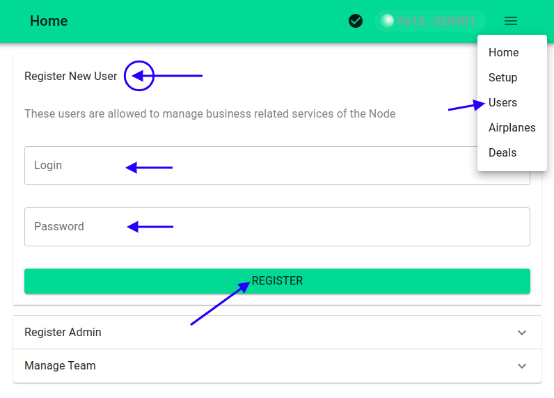
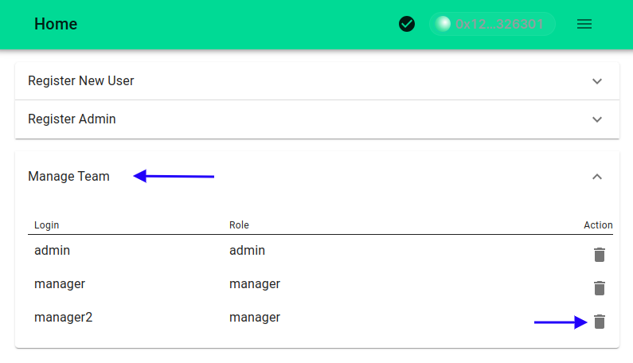

# Configuring the Supplier's Node Management Dapp

The Supplier's Node Management Dapp is an integral component for managing various aspects of a supplier's operations within the WindingTree Market Protocol. This guide will walk you through configuring your Dapp to ensure seamless integration with your Node host and IPFS storage, as well as detail the functionalities it offers.

## Configuration Steps

### Setting Up the Supplier's Node API URI

1. Navigate to the `Setup` option in the main Dapp menu.
2. Open the `Node` tab.
3. Input your Node host URL in the provided form field.

> The default Node URL in the MVP is: `https://node.windingtree.com/api`

### Configuring IPFS Storage API Credentials

1. Go to the `Setup` option in the main Dapp menu.
2. Access the `IPFS` tab.
3. Log in at `https://dashboard.particle.network/#/login`.
4. Create a new project by selecting `Add New Project`.
5. Copy the Project ID and Server Key into the Dapp form.

This setup activates IPFS storage functionalities within the Dapp, allowing you to curate an image gallery for your properties.

### Registering the Supplier's Entity

1. Choose the `Setup` option in the Dapp menu.
2. Proceed to the `Register` tab.
3. Connect your wallet and select an account for entity ownership.
4. Generate a node signer mnemonic for offer signings and transactions. This account won't access funds directly.
5. Create an entity account salt.
6. Initiate the registration transaction on the protocol's smart contract.

### Reviewing the Supplier's Entity

1. Access `Setup` from the Dapp menu.
2. Navigate to the `View` tab.
3. To review a previously registered entity, input the entity ID.
4. Verify the entity owner's and node signer's balances. Use Metamask's `send` feature to top up the signer's balance if necessary.
5. Check the deposit value in LIF tokens.
6. Ensure the entity's status is `enabled` to process requests and deals.

### Managing the Entity's LIF Deposit

> Ensure the entity owner's wallet is connected.

1. Head to `Setup` in the Dapp menu.
2. Choose the `Manage` tab.
3. Select `Manage LIF deposit of the entity`.
4. Input a deposit value at or above the `Minimum deposit value`. Use `use this value` for autofill.
5. If you lack test LIF tokens, refer to [this guide](./imp.contracts.md#test-stablecoins).
6. Execute the transaction for the LIF deposit.
7. Post-transaction, you can verify the `Current deposit value`.

### Enabling and Disabling the Entity

1. Select `Setup` from the main menu.
2. Access the `Manage` tab.
3. Use `Toggle the supplier's entity status` to check or change the entity's status.
4. Confirm the entity's current status.
5. Alter the status as needed by transacting.

### Managing Dapp Users

#### Registering an Admin

> Only the entity owner can register an administrative user.

> Assuming the entity owner's wallet is connected:

1. Choose `Users` from the Dapp menu.
2. Select `Register Admin`.
3. Fill in the `Login Name`.
4. Confirm by `Register Admin`, then sign the login voucher with your wallet.

#### Registering a Manager

1. Access `Users` from the Dapp menu.
2. Open `Register New User`.
3. Ensure you're logged in as an admin.
4. Provide login credentials; the manager can change the password later.
5. Confirm by clicking `Register`.

#### Removing Users

> Admin login is required for this operation.

1. Navigate to `Users` in the Dapp menu.
2. Go to `Manage Team`.
3. Review team members and click `Delete` to remove a user.

This guide aims to streamline the Dapp configuration process, ensuring you can effectively manage your supplier's node and utilize all the functionalities of the WindingTree Market Protocol.
