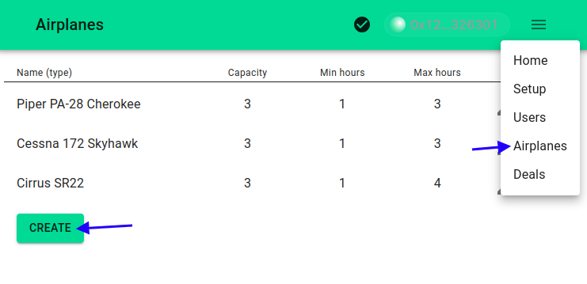
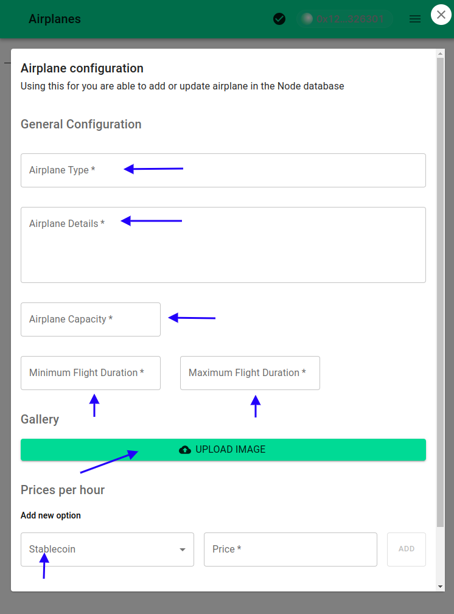
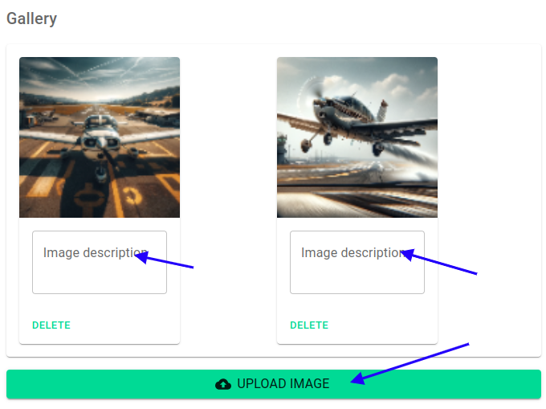
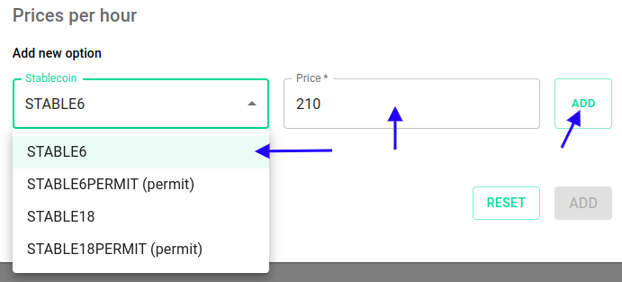

# Managing Properties in the Dapp

The MVP introduces an intuitive feature for booking airplanes for touristic tours, serving as a practical demonstration of managing properties through a specialized database. This database catalogues airplanes with specific attributes, including rental prices per hour. Each airplane record is meticulously detailed to ensure a comprehensive understanding and seamless booking experience.

## Navigating to the Airplanes Section

To begin managing your airplane listings, log in to the supplier's node management Dapp as an admin and navigate to the `Airplanes` section.

1. Select the `Airplanes` option from the main menu.
2. Ensure you are logged in with admin credentials.

## Creating an Airplane Record

The process of adding a new airplane to your offerings involves several detailed steps, ensuring that all necessary information is accurately captured.

### Entering General Information

- **Airplane Type**: Specify a concise name for the airplane. This name will appear in offer titles and should be instantly recognizable.
- **Airplane Details**: Provide a thorough description of the airplane. The Dapp supports Markdown syntax for rich text formatting.
- **Airplane Capacity**: Indicate the maximum number of passengers the airplane can accommodate.
- **Flight Duration Limits**: State the minimum and maximum flight duration in hours, defining the range of possible booking durations.

### Uploading to the Airplane Gallery

- Use the `Upload Image` button to add images from your local drive to IPFS. Thumbnails are generated automatically during this process.
- There is no limit to the number of images you can upload, allowing for a rich visual representation of each airplane.
- Image descriptions also support Markdown, enabling detailed captions and annotations.

### Setting Rental Prices

- This section allows you to define rental prices in stablecoins supported by the protocol. Each price denotes the cost per hour of renting the airplane.
- The MVP includes four ERC-20 compatible tokens, acting as stablecoins, to offer a variety of payment options.
- Clients will see all listed prices as options during the booking process, facilitating informed decision-making based on their preferences or available funds.

By following these steps, you can effectively manage your fleet of airplanes within the Dapp, offering detailed listings that include general information, visual galleries, and flexible pricing in stablecoins. This structured approach not only enhances the booking experience for clients but also streamlines the property management process for suppliers.
