# WindingTree Market Protocol MVP Architecture

## Introduction

### Purpose
Brief description of the document’s purpose.

### Scope
Outline of what is covered in this document.

### Definitions
List of terms, acronyms, and abbreviations used in this document.

### References

- [**Server Specification**](./server-spec.md)
- [**Supplier Node Specification**](./node-spec.md)
- [**Client Dapp Specification**](./dapp-client-spec.md)
- [**Supplier Dapp Specification**](./dapp-supplier-spec.md)

## Modules/Components

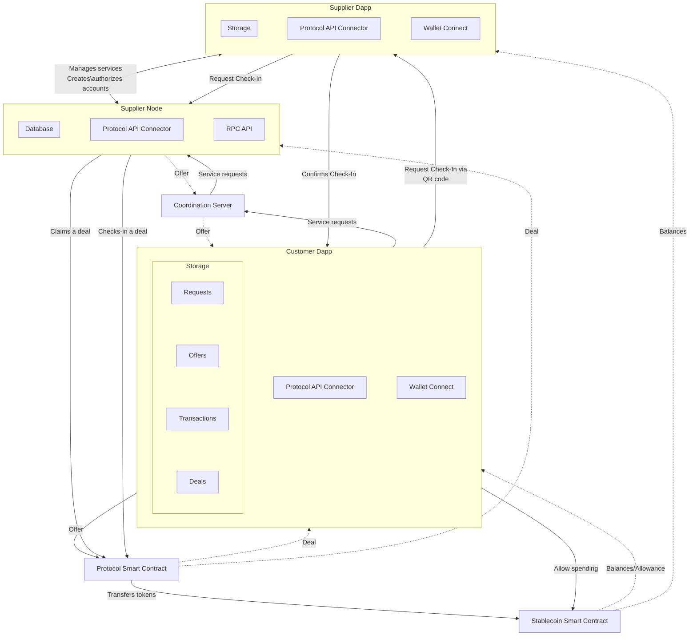
```mermaid
flowchart TB
  subgraph customer[Customer Dapp]
    direction LR
    subgraph c_storage[Storage]
      direction TB
      Requests ~~~
      Offers ~~~
      Transactions ~~~
      Deals
    end
    c_api[Protocol API Connector]
    c_wallet[Wallet Connect]

    c_storage ~~~
    c_api ~~~
    c_wallet
  end

  server[Coordination Server]
  contract[Protocol Smart Contract]
  coin[Stablecoin Smart Contract]

  subgraph node[Supplier Node]
    direction LR
    subgraph n_db[Database]
    end
    n_api[Protocol API Connector]
    n_rpc[RPC API]

    n_db ~~~
    n_api ~~~
    n_rpc
  end

  subgraph manager[Supplier Dapp]
    direction LR
    subgraph m_storage[Storage]
      direction TB
    end
    m_api[Protocol API Connector]
    m_wallet[Wallet Connect]

    m_storage ~~~
    m_api ~~~
    m_wallet
  end

  %% Request flow
  customer -- Service requests --> server
  server -- Service requests --> node

  %% Offer flow
  node -. Offer .-> server
  server -. Offer .-> customer

  %% Deal flow
  customer -- Offer --> contract
  coin -. Balances/Allowance .-> customer
  customer -- Allow spending --> coin
  contract -- Transfers tokens --> coin
  contract -. Deal .-> customer
  contract -. Deal .-> node

  %% Deal claim flow
  node -- Claims a deal --> contract

  %% Node manager flow
  manager <-- Manages services\nCreates\authorizes accounts --> node
  coin -. Balances .-> manager

  %% Check-In flow
  customer -- Request Check-In via\nQR code --> manager
  manager -- Request Check-In  --> node
  node -- Checks-in a deal --> contract
  manager -- Confirms Check-In --> customer
```

## Supplier Use-Cases

### Supplier Registration

> During this flow, the supplier must copy the Node configuration parameters and provide them with the Node as environment variables

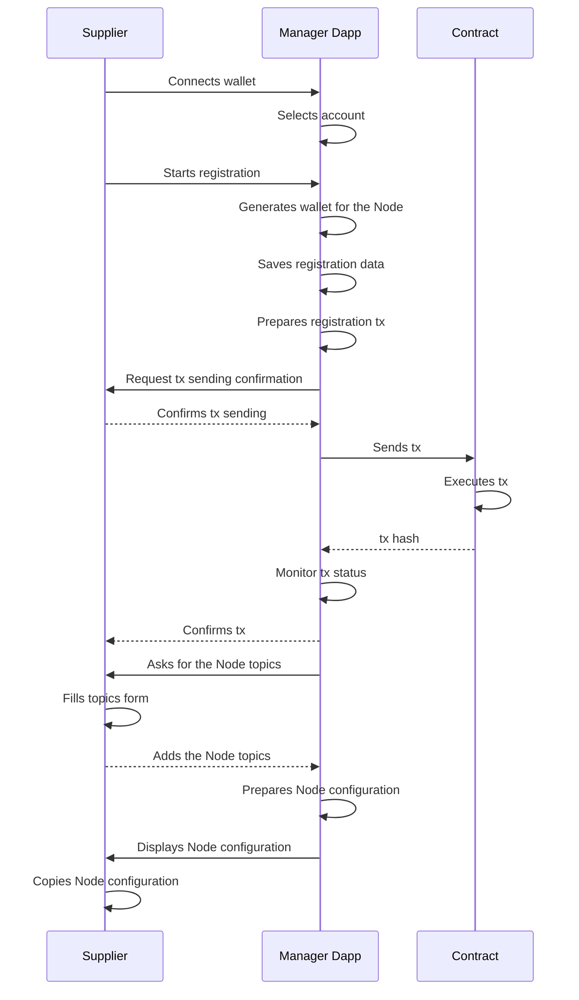
```mermaid
sequenceDiagram
  participant supplier as Supplier
  participant manager as Manager Dapp
  participant contract as Contract

  supplier->>manager: Connects wallet
  manager->>manager: Selects account
  supplier->>manager: Starts registration
  manager->>manager: Generates wallet for the Node
  manager->>manager: Saves registration data
  manager->>manager: Prepares registration tx
  manager->>supplier: Request tx sending confirmation
  supplier-->>manager: Confirms tx sending
  manager->>contract: Sends tx
  contract->>contract: Executes tx
  contract-->>manager: tx hash
  manager->>manager: Monitor tx status
  manager-->>supplier: Confirms tx
  manager->>supplier: Asks for the Node topics
  supplier->>supplier: Fills topics form
  supplier-->>manager: Adds the Node topics
  manager->>manager: Prepares Node configuration
  manager->>supplier: Displays Node configuration
  supplier->>supplier: Copies Node configuration
```

### Supplier Node Configuration

The Node configuration parameters are been generated during the [`Supplier Registration`](#supplier-registration) flow.

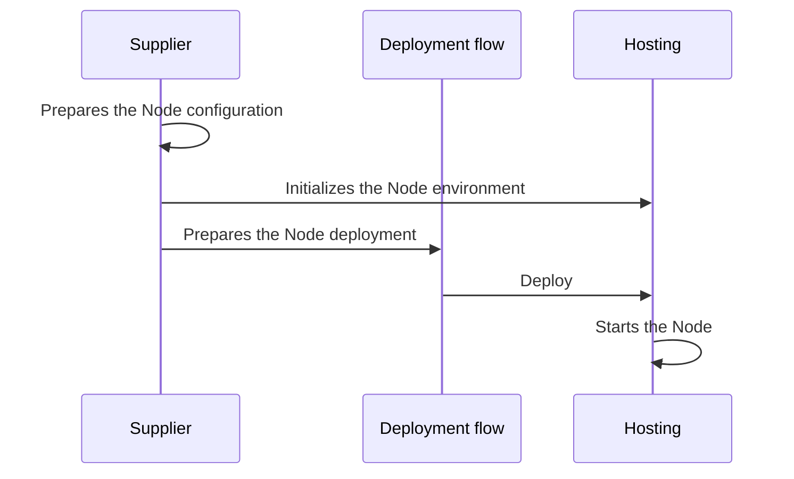
```mermaid
sequenceDiagram
  participant supplier as Supplier
  participant node as Deployment flow
  participant host as Hosting

  supplier->>supplier: Prepares the Node configuration
  supplier->>host: Initializes the Node environment
  supplier->>node: Prepares the Node deployment
  node->>host: Deploy
  host->>host: Starts the Node
```

### Administrative Log-In

To manage the Node the supplier must use the Node Manager Dapp. To be able to access the dapp features the supplier must log in using the wallet that has been used for sending the registration transaction.

Here is the log-in flow:

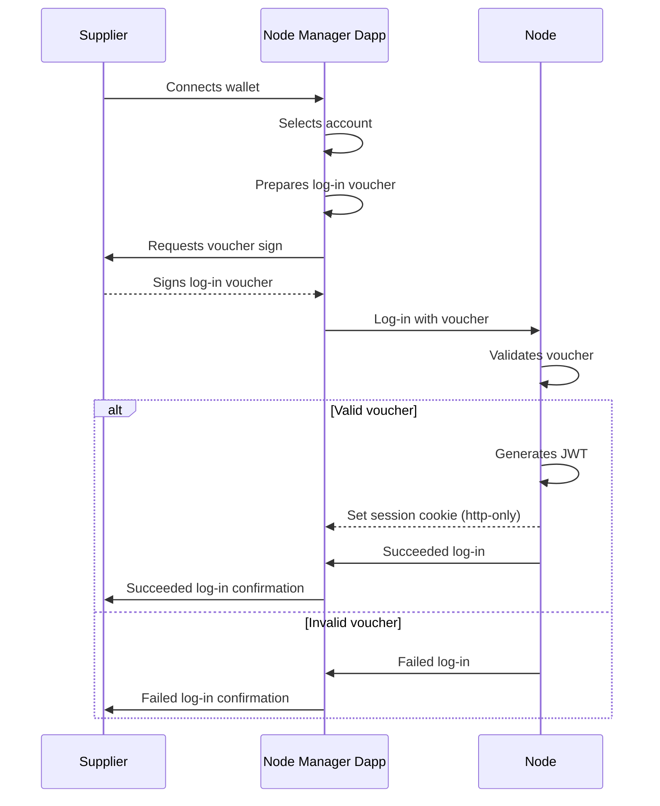
```mermaid
sequenceDiagram
  participant supplier as Supplier
  participant manager as Node Manager Dapp
  participant node as Node

  supplier->>manager: Connects wallet
  manager->>manager: Selects account
  manager->>manager: Prepares log-in voucher
  manager->>supplier: Requests voucher sign
  supplier-->>manager: Signs log-in voucher
  manager->>node: Log-in with voucher
  node->>node: Validates voucher

  alt Valid voucher
    node->>node: Generates JWT
    node-->>manager: Set session cookie (http-only)
    node->>manager: Succeeded log-in
    manager->>supplier: Succeeded log-in confirmation
  else Invalid voucher
    node->>manager: Failed log-in
    manager->>supplier: Failed log-in confirmation
  end
```

### Users accounts management

Users of the Node Manager Dapp are employees who work with customers at the reception desk and manage the check-in flow. The supplier must create accounts for these users.

#### User account registration

Here is the users accounts registration flow:

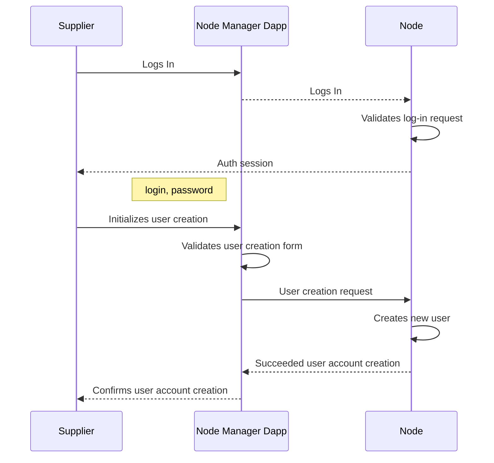
```mermaid
sequenceDiagram
  participant supplier as Supplier
  participant manager as Node Manager Dapp
  participant node as Node

  supplier->>manager: Logs In
  manager-->>node: Logs In
  node->>node: Validates log-in request
  node-->>supplier: Auth session
  Note left of manager: login, password
  supplier->>manager: Initializes user creation
  manager->>manager: Validates user creation form
  manager->>node: User creation request
  node->>node: Creates new user
  node-->>manager: Succeeded user account creation
  manager-->>supplier: Confirms user account creation
```

#### User account log in

Here the log-in flow:

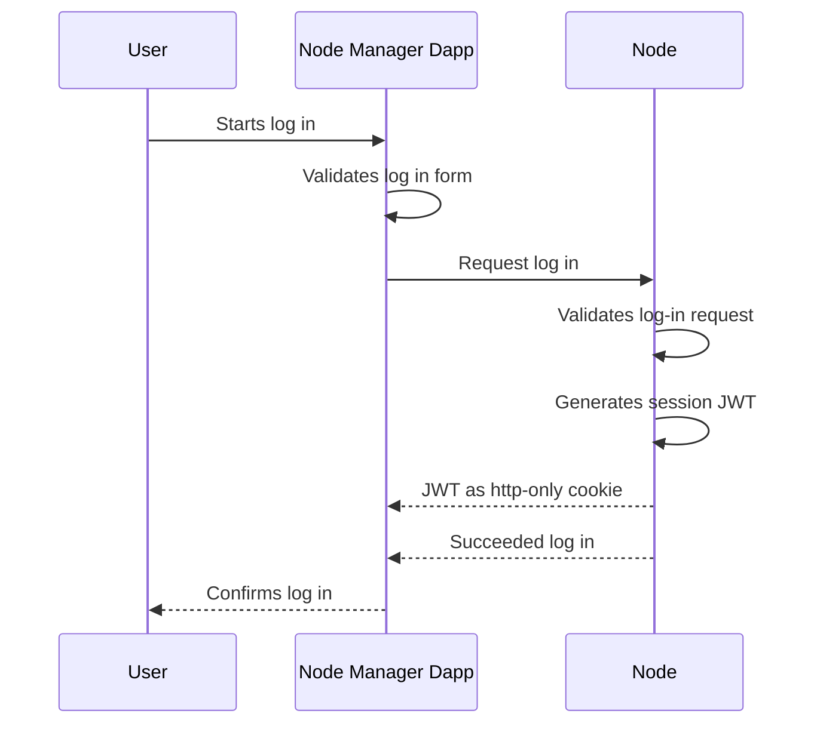
```mermaid
sequenceDiagram
  participant user as User
  participant manager as Node Manager Dapp
  participant node as Node

  user->>manager: Starts log in
  manager->>manager: Validates log in form
  manager->>node: Request log in
  node->>node: Validates log-in request
  node->>node: Generates session JWT
  node-->>manager: JWT as http-only cookie
  node-->>manager: Succeeded log in
  manager-->>user: Confirms log in
```

#### User account password change

Logged In user is able to change the password of their account:

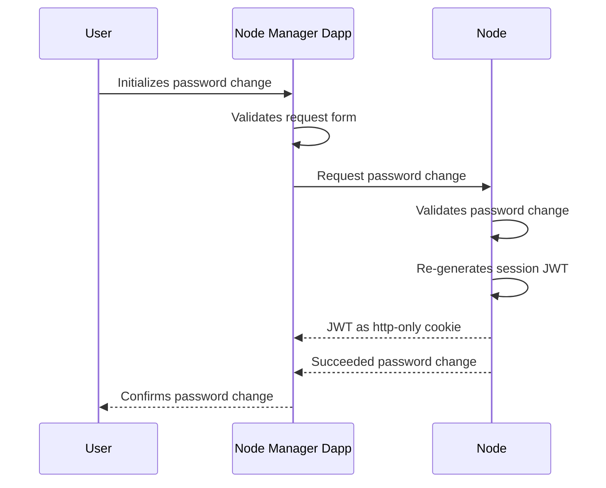
```mermaid
sequenceDiagram
  participant user as User
  participant manager as Node Manager Dapp
  participant node as Node

  user->>manager: Initializes password change
  manager->>manager: Validates request form
  manager->>node: Request password change
  node->>node: Validates password change
  node->>node: Re-generates session JWT
  node-->>manager: JWT as http-only cookie
  node-->>manager: Succeeded password change
  manager-->>user: Confirms password change
```

### Service Items Management

Service items are products that the supplier sells to its customers. In this MVP, implemented simple flight booking workflow. So, in this case, a service item is flight.

> Assuming that all service management flows are applied to logged-in users.

#### Service Items Parameters

A flight metadata:

- flight Id
- flight name
- flight description
- list of images
- type of a plane (balloon, glider, etc)
- passengers capacity
- duration (hours)
- rules (pdf file)

A flight attributes:

- date
- departure time

A flight availability slot:

- flight Id
- date
- time from
- time to
- price full (exclusive)
- price (per each passenger)

#### Flights management

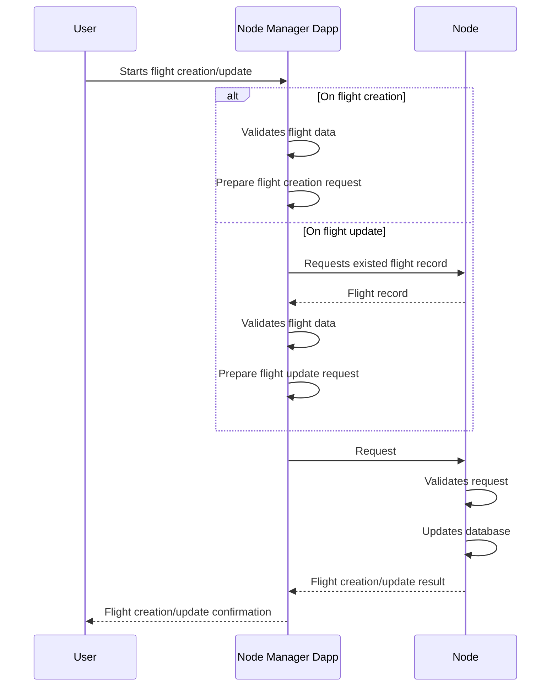
```mermaid
sequenceDiagram
  participant user as User
  participant manager as Node Manager Dapp
  participant node as Node

  user->>manager: Starts flight creation/update

  alt On flight creation
    manager->>manager: Validates flight data
    manager->>manager: Prepare flight creation request
  else On flight update
    manager->>node: Requests existed flight record
    node-->>manager: Flight record
    manager->>manager: Validates flight data
    manager->>manager: Prepare flight update request
  end

  manager->>node: Request
  node->>node: Validates request
  node->>node: Updates database
  node-->>manager: Flight creation/update result
  manager-->>user: Flight creation/update confirmation
```

#### Availability management

Availability management is based on the time-slots concept. A manager must explicitly define flight time slots when they can be booked. Initially, these slots will be marked as "open". When a customer books a concrete slot, this slot is marked as "booked" and the customer's deal is linked with it.

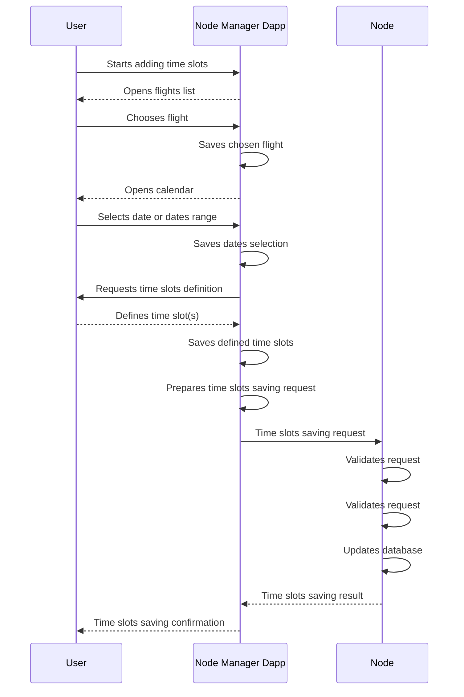
```mermaid
sequenceDiagram
  participant user as User
  participant manager as Node Manager Dapp
  participant node as Node

  user->>manager: Starts adding time slots
  manager-->>user: Opens flights list
  user->>manager: Chooses flight
  manager->>manager: Saves chosen flight
  manager-->>user: Opens calendar
  user->>manager: Selects date or dates range
  manager->>manager: Saves dates selection
  manager->>user: Requests time slots definition
  user-->>manager: Defines time slot(s)
  manager->>manager: Saves defined time slots
  manager->>manager: Prepares time slots saving request
  manager->>node: Time slots saving request
  node->>node: Validates request
  node->>node: Validates request
  node->>node: Updates database
  node-->>manager: Time slots saving result
  manager-->>user: Time slots saving confirmation
```

#### Booking management

The booking management is split into the following flows:

- Offers creation
- Claiming of deals
- Overbooking
- Check-In
- Refund

> Assuming that queries from customers and offers from suppliers are reaching each other via the protocol way and can be omitted on diagrams. On diagrams, such messages will be defined as direct connections.

Here is the offers creation flow:

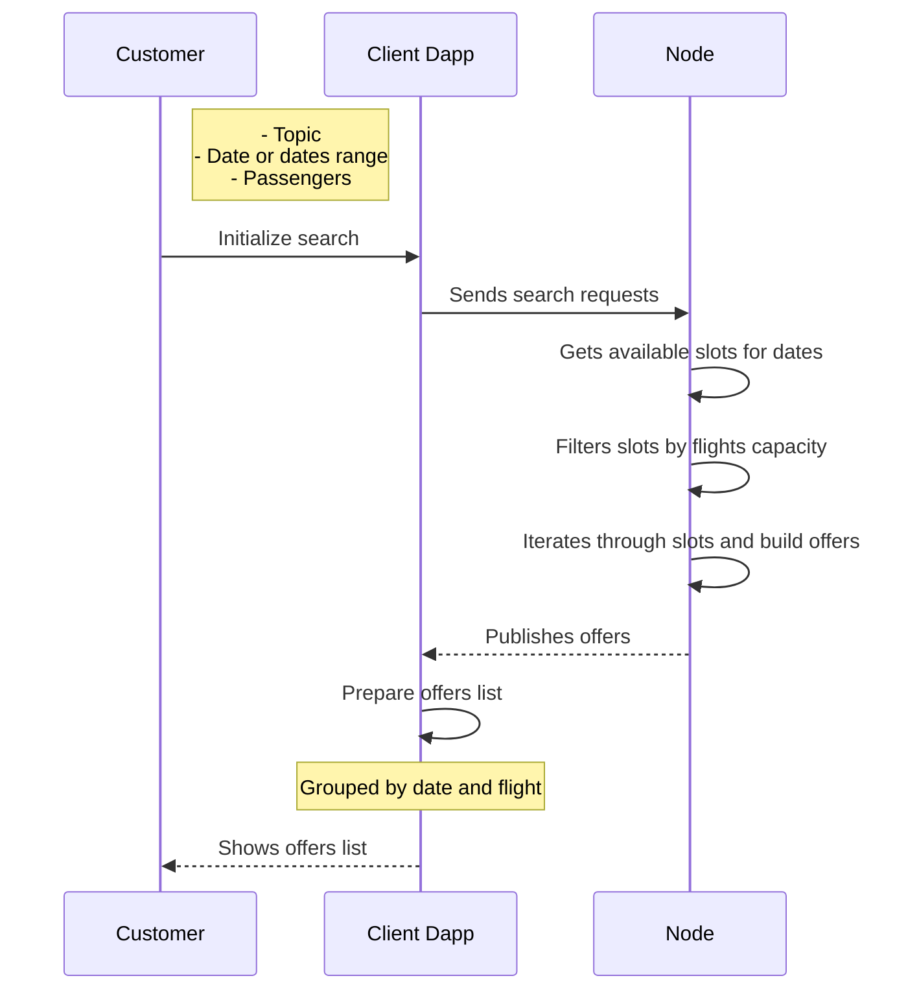
```mermaid
sequenceDiagram
  participant customer as Customer
  participant client as Client Dapp
  participant node as Node

  Note left of client: - Topic<br>- Date or dates range<br>- Passengers
  customer->>client: Initialize search
  client->>node: Sends search requests
  node->>node: Gets available slots for dates
  node->>node: Filters slots by flights capacity
  node->>node: Iterates through slots and build offers
  node-->>client: Publishes offers
  client->>client: Prepare offers list
  Note over client: Grouped by date and flight
  client-->>customer: Shows offers list
```

> Deals creation is described [below](#payment-for-offer)

> Overbooking is a situation when two or more customers are made a "Deal" for the same offer

Here is deals claiming flow:

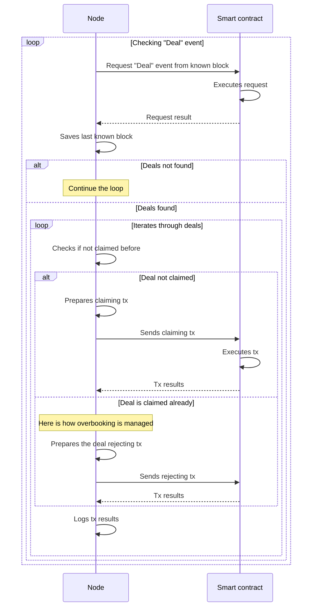
```mermaid
sequenceDiagram
  participant node as Node
  participant contract as Smart contract

  loop Checking "Deal" event
    node->>contract: Request "Deal" event from known block
    contract->>contract: Executes request
    contract-->>node: Request result
    node->>node: Saves last known block

    alt Deals not found
      Note over node: Continue the loop
    else Deals found
      loop Iterates through deals
        node->>node: Checks if not claimed before
        alt Deal not claimed
          node->>node: Prepares claiming tx
          node->>contract: Sends claiming tx
          contract->>contract: Executes tx
          contract-->>node: Tx results
        else Deal is claimed already
          Note over node: Here is how overbooking is managed
          node->>node: Prepares the deal rejecting tx
          node->>contract: Sends rejecting tx
          contract-->>node: Tx results
        end
        node->>node: Logs tx results
      end
    end
  end
```

Here is how a deal refund is working:

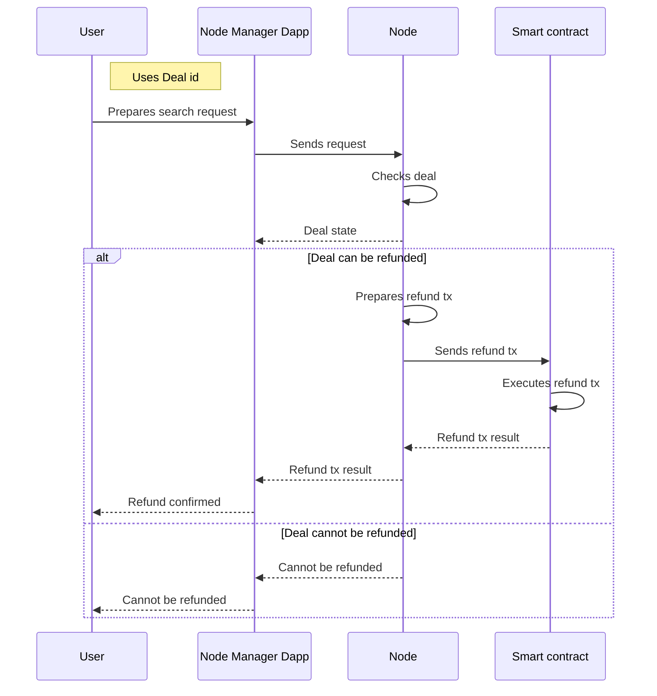
```mermaid
sequenceDiagram
  participant user as User
  participant manager as Node Manager Dapp
  participant node as Node
  participant contract as Smart contract

  Note right of user: Uses Deal id
  user->>manager: Prepares search request
  manager->>node: Sends request
  node->>node: Checks deal
  node-->>manager: Deal state

  alt Deal can be refunded
    node->>node: Prepares refund tx
    node->>contract: Sends refund tx
    contract->>contract: Executes refund tx
    contract-->>node: Refund tx result
    node-->>manager: Refund tx result
    manager-->>user: Refund confirmed
  else Deal cannot be refunded
    node-->>manager: Cannot be refunded
    manager-->>user: Cannot be refunded
  end
```

Here is how Check-In is working:

> The customer is able to create a check-in QR code and download it before visiting the supplier's reception. This way, the customer will display QR from his device without access to his crypto wallet.

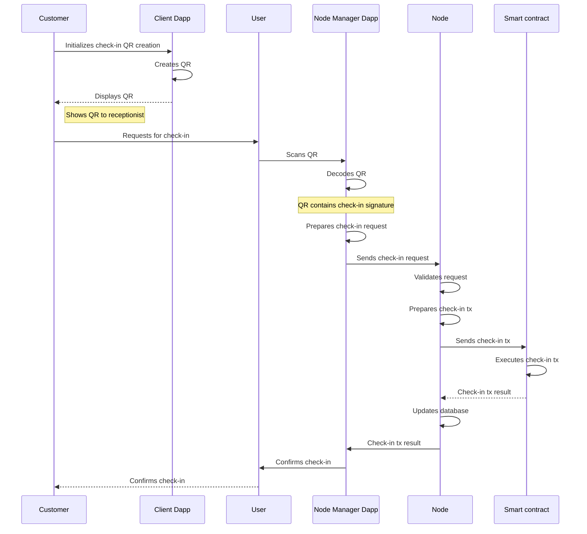
```mermaid
sequenceDiagram
  participant customer as Customer
  participant client as Client Dapp
  participant user as User
  participant manager as Node Manager Dapp
  participant node as Node
  participant contract as Smart contract

  customer->>client: Initializes check-in QR creation
  client->>client: Creates QR
  client-->>customer: Displays QR
  Note right of customer: Shows QR to receptionist
  customer->>user: Requests for check-in
  user->>manager: Scans QR
  manager->>manager: Decodes QR
  Note over manager: QR contains check-in signature
  manager->>manager: Prepares check-in request
  manager->>node: Sends check-in request
  node->>node: Validates request
  node->>node: Prepares check-in tx
  node->>contract: Sends check-in tx
  contract->>contract: Executes check-in tx
  contract-->>node: Check-in tx result
  node->>node: Updates database
  node->>manager: Check-in tx result
  manager->>user: Confirms check-in
  user-->>customer: Confirms check-in
```

## Customer-only Use-Cases

### Wallet Connection

This is the usual "WalletConnect" flow. The customer is able to connect his Metamask wallet (browser extension) or mobile wallet via this feature.

### Blockchain Network Selection

A customer Dapp must be connected to the blockchain network supported by Monerium stablecoin provider (Ethereum, Gnosis, and Polygon).
If the Dapp is connected to unsupported network a user must be able to re-connect it to the right one.

### Search Request

A user of the customer Dapp navigates to the airport location using a map or a simple list of links. Using the airport geo-location the Dapp calculates a search request topic.

The protocol recommends using H3 (Hexagonal hierarchical geospatial indexing system) for representing geolocation-based topics. An example H3 hash looks like this: `87283472bffffff`.

To convert traditional lat/lng coordinates to an H3 hash and vice versa, you can use the `h3` utility from `@windingtree/sdk-utils`.

Suppliers also calculate their topics using the geo-location of airports to which they belong. Suppliers nodes are listening for search requests using these topics.

This way, search requests that contain needed airport topics will be obtained by a node that listens for them.

### Payment for Offer

> Assuming that Dapp is connected to the user's wallet already

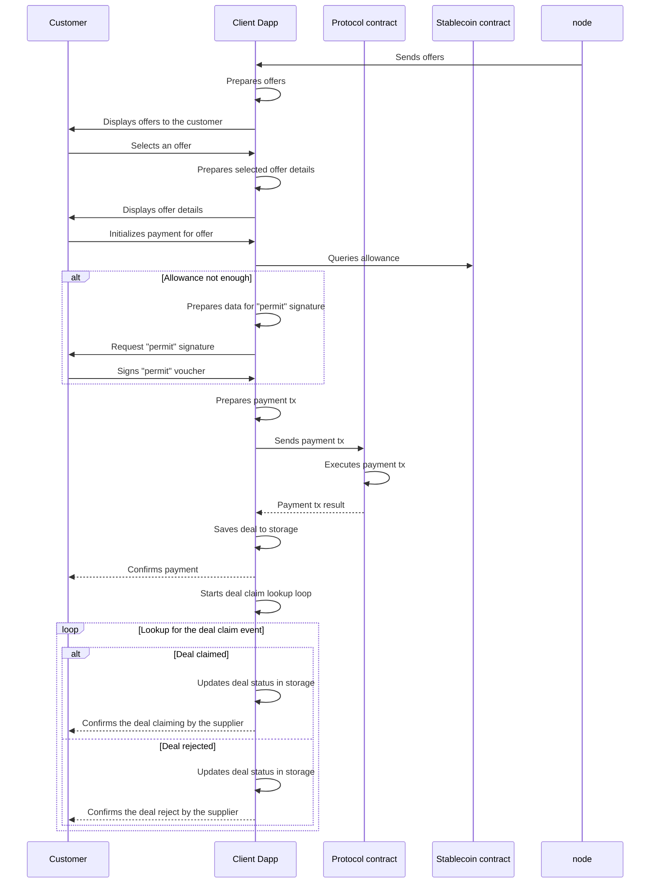
```mermaid
sequenceDiagram
  participant customer as Customer
  participant client as Client Dapp
  participant contract as Protocol contract
  participant coin as Stablecoin contract

  node->>client: Sends offers
  client->>client: Prepares offers
  client->>customer: Displays offers to the customer
  customer->>client: Selects an offer
  client->>client: Prepares selected offer details
  client->>customer: Displays offer details
  customer->>client: Initializes payment for offer
  client->>coin: Queries allowance

  alt Allowance not enough
    client->>client: Prepares data for "permit" signature
    client->>customer: Request "permit" signature
    customer->>client: Signs "permit" voucher
  end

  client->>client: Prepares payment tx
  client->>contract: Sends payment tx
  contract->>contract: Executes payment tx
  contract-->>client: Payment tx result
  client->>client: Saves deal to storage
  client-->>customer: Confirms payment
  client->>client: Starts deal claim lookup loop

  loop Lookup for the deal claim event
    alt Deal claimed
      client->>client: Updates deal status in storage
      client-->>customer: Confirms the deal claiming by the supplier
    else Deal rejected
      client->>client: Updates deal status in storage
      client-->>customer: Confirms the deal reject by the supplier
    end
  end
```

### Deal Cancellation

Deal can be cancelled according the protocol and offer rules.

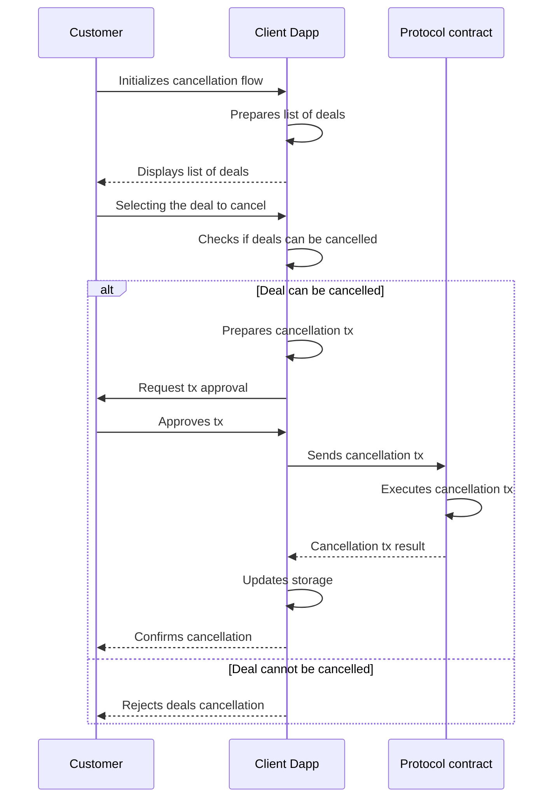
```mermaid
sequenceDiagram
  participant customer as Customer
  participant client as Client Dapp
  participant contract as Protocol contract

  customer->>client: Initializes cancellation flow
  client->>client: Prepares list of deals
  client-->>customer: Displays list of deals
  customer->>client: Selecting the deal to cancel
  client->>client: Checks if deals can be cancelled

  alt Deal can be cancelled
    client->>client: Prepares cancellation tx
    client->>customer: Request tx approval
    customer->>client: Approves tx
    client->>contract: Sends cancellation tx
    contract->>contract: Executes cancellation tx
    contract-->>client: Cancellation tx result
    client->>client: Updates storage
    client-->>customer: Confirms cancellation
  else Deal cannot be cancelled
    client-->>customer: Rejects deals cancellation
  end
```

## Implementation
Description of how the architecture is implemented.

### Overview
General description of the implementation view.

### Layers
Description of the layers of the architecture.

## Processes
Description of the processes, tasks, and activities.

## Deployment
Description of the deployment architecture and environment.

## Cross-cutting Concerns
Description of concerns such as logging, error handling, etc.
