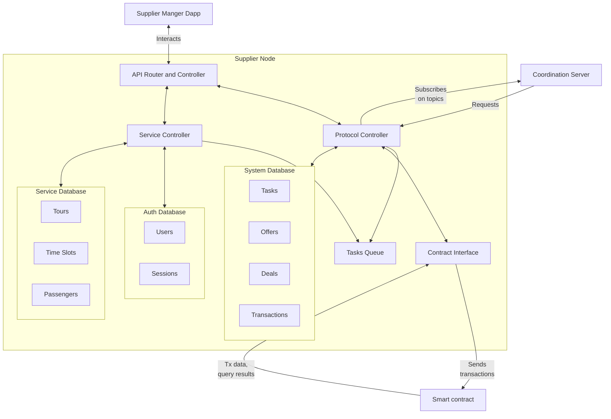
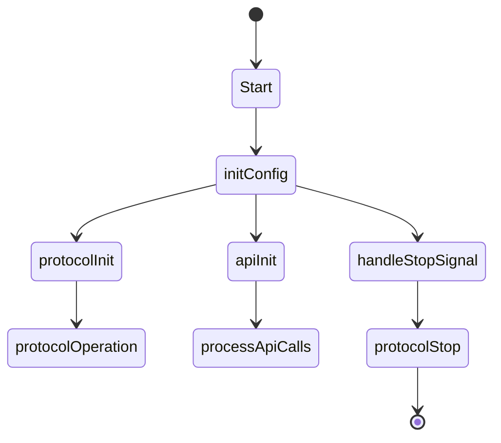
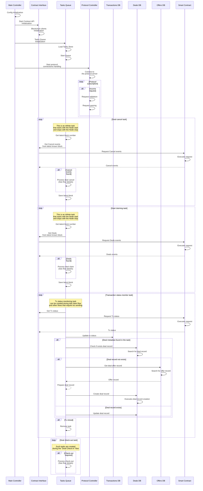
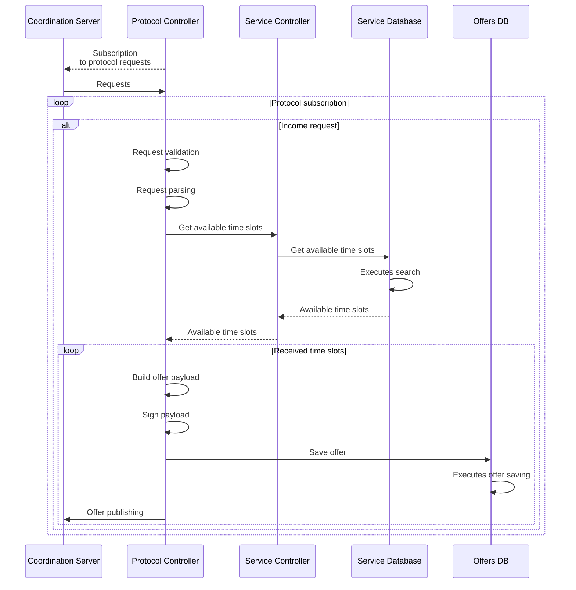
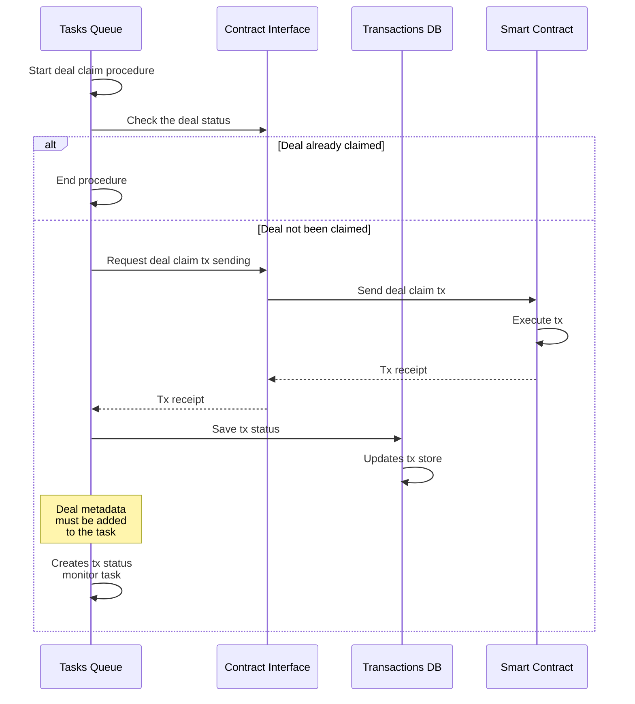
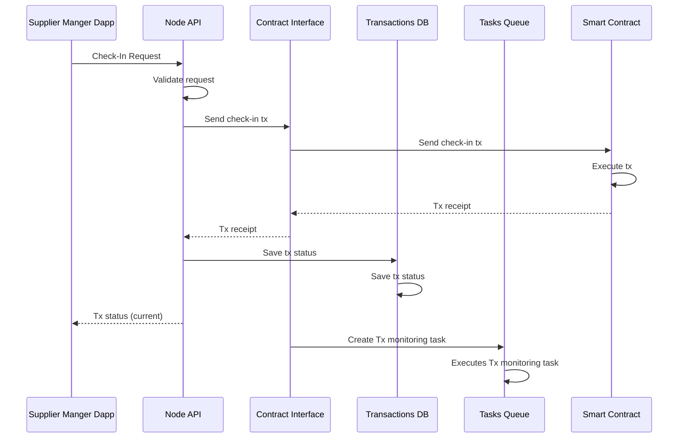
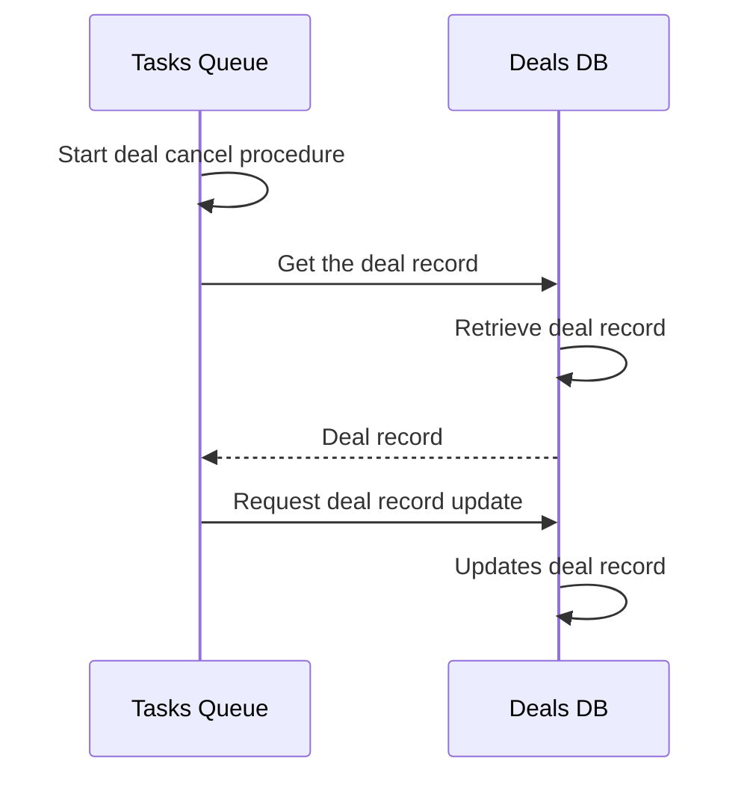
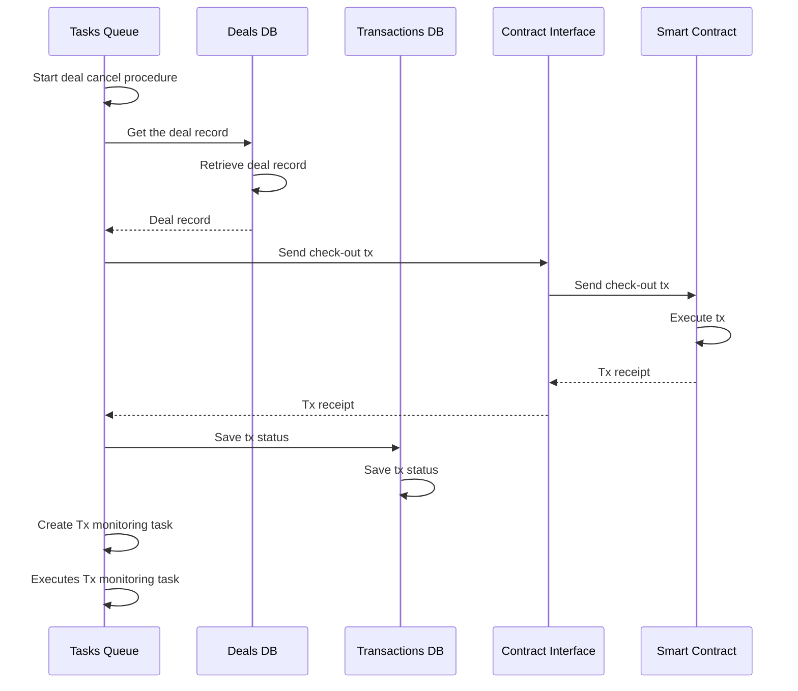
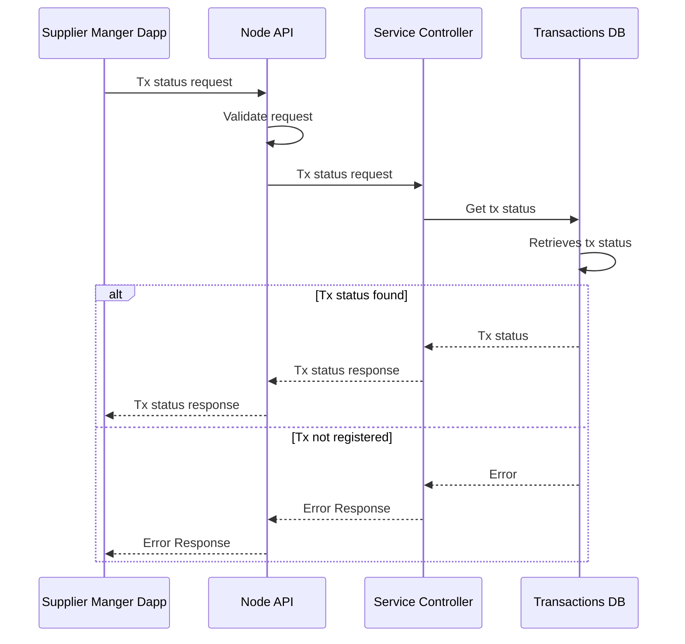
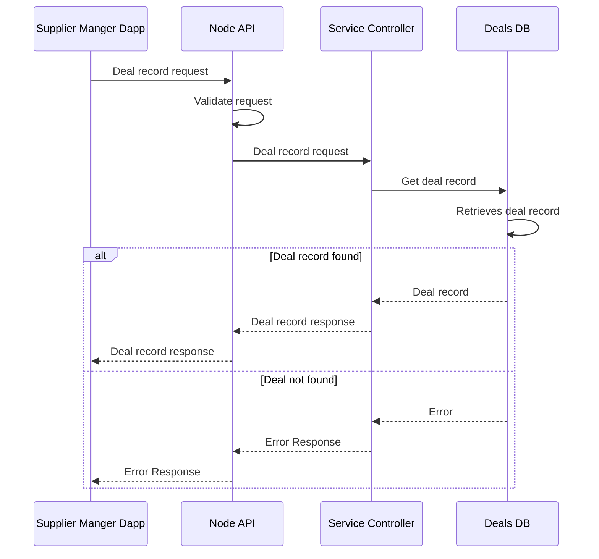

# WindingTree Market Protocol Supplier Node Specification

## Overview

The "Supplier's Node" is a pivotal component of the WindingTree Market Protocol, designed to streamline interactions between suppliers and the decentralized market ecosystem. This document outlines the key features, functionalities, and technical design of the Supplier's Node, serving as a comprehensive guide for development and integration within the broader WindingTree infrastructure.

### Purpose and Functionality

The Supplier's Node primarily facilitates the management of services, deals, and interactions with the WindingTree Market Protocol. It acts as a bridge between suppliers and the blockchain, enabling efficient handling of service offerings, booking management, and transaction processing. Key functionalities include:

- Management of service offerings, including creation, update, and deletion of service items.
- Handling customer bookings and time slot management for services.
- Processing transactions and smart contract interactions, ensuring secure and efficient deal execution.
- Integration with the Coordination Server and Supplier Manager Dapp to streamline service operations and user interactions.

### Role in WindingTree Ecosystem

As an integral part of the WindingTree Market Protocol, the Supplier's Node plays a critical role in:

- Ensuring real-time synchronization with the blockchain for up-to-date service offerings and bookings.
- Providing a reliable and secure interface for suppliers to manage their services and interact with the decentralized market.
- Enhancing the scalability and flexibility of the WindingTree ecosystem, accommodating a diverse range of services and operational models.

### Target Users

The primary users of the Supplier's Node include:

- Service providers and suppliers who wish to offer their services on the WindingTree platform.
- Developers and system integrators responsible for setting up and maintaining the Node within the supplier's IT infrastructure.
- Market Protocol contributors and enthusiasts looking to understand and enhance the Supplier's Node functionalities.

This overview sets the stage for a detailed exploration of the Supplier's Node, including its technical requirements, system architecture, and integration with the WindingTree Market Protocol. The subsequent sections of this document will delve deeper into each of these areas, providing a clear roadmap for the development and deployment of the Supplier's Node.


## Technical Requirements

### Technology Stack

- **Node.js** (LTS)
- **Typescript**
- **tRPC** (external API)
- **viem** (blockchain connectivity)
- `@windingtree/sdk*` packages (protocol features)
- **LevelDB** as database (`level` module from `@windingtree/sdk/storage`)

> LevelDB easily fits the Node service needs but for maybe not be so good for the availability management of tours. This issue will be solved during the Node development.

## Architecture and Design

### System Architecture



> Offers records stored in the database have an expiration time that is calculated as an offer expiration time with an added time gap that can be configured via the Node config file. When a record is expired it should be deleted from the database.

## Use Cases and Algorithms

### Node States



### Protocol Flow

#### Protocol Initialization and common tasks



#### Offers Flow



Here is the recommended `Request` structure.

> `Request` data structure must be inherited from `GenericQuery` from the `@windingtree/sdk-types` package

> Dates always must be interpreted as in the airport timezone

```typescript
interface CustomRequest extends GenericQuery {
  passengers: number; // Number of passengers
  children: number; // Number of children (cannot be greater than `passengers` - 1)
  dateFrom: string; // ISO Date
  dateTo: string; // ISO Date
  timeFrom: number; // Day time from
  duration: number; // Day time to (must be greater than `timeFrom`)
}
```

Here is the recommended `Offer` options structure.

> Data structure of options of `Offer` must be inherited from `GenericOfferOptions` from the `@windingtree/sdk-types` package

```typescript
interface GalleryImage {
  thumbnail: string;
  image: string;
}

interface CustomOfferOptions extends GenericOfferOptions {
  name: string; // Tour name
  description: string; // Tour description
  capacity: number; // Maximum number of passengers
  gallery: GalleryImage[];
  uri: string; // Link to the tour details
  date: string; // ISO Date
  // Time slot
  timeFrom: number; // Day time from
  duration: number; // Duration of the tour
}
```

#### Deal Claim

> This flow starts during the [Protocol Initialization flow](#protocol-initialization)



#### Deal Check-In



> For sent Tx status monitoring the dapp must use [Transaction status monitoring](#transaction-status-monitoring-flow) flow

#### Deal Cancel

Customers are able to cancel their deals in the following cases:

- Before a deal claim event in full scale
- After the deal claim event according to offer rules



#### Deal Check-Out

> The idea is to start the check-out procedure automatically using the dedicated task. This task will be created during the check-in procedure.



### Dapp Auth Flow (Admin)

> See logic in the Market Protocol SDK supplier Dapp example

### Dapp Auth Flow (Manager)

> See logic in the Market Protocol SDK supplier Dapp example

### Transaction status monitoring flow



### Deal status flow



### Refund Flow

TBD in next the next MVP version.

### Availability Management

Tours availability is managed in the frame of the following concept:

- Tours identity and metadata stored as `tour` records
- `tour` records contains the following data:
  - **name**: Tour name
  - **description**: Tour description
  - **uri**: Link to the tour details (optional)
  - **gallery**: Array of links to images (with thumbs)
  - **capacity**: Maximum number of passengers
  - **price**: Array of prices in various tokens
- Availability calendar is formed from time slots that can be dynamically added to the database
- Time slot has the following configuration:
  - **tour**: Tour Id
  - **date**: ISO date, a date when the tour can be carried out
  - **timeFrom**: Start of the tour
  - **duration**: Duration of the tour
  - **deal**: Id of the deal that books this time slot (nullable). If equal to `null` that means that this time slot is open and booked otherwise.
- All records must be handled via the CRUD model
- If time slot is booked and not expired related tour cannot be deleted
- If time slot is booked it cannot be updated or deleted

## API and Integration

### External API Interfaces

The Node must expose the following functions as tRPC API implemented using NodeApiServer from SDK (see `@windingtree/sdk-node-api/server`).

> Functions marked by <sup>(auth)</sup> available for authenticated users only.

#### Basic functions

- All functions exposed by NodeApiServer

#### Service functions

- **txStatus**: Returns status of a transaction requested by hash
- **dealStatus**: Returns status of a deal requested by offer Id

#### Reception functions

- checkIn <sup>(auth)</sup>: Initializes check in procedure

#### Availability management functions

- **getTours** <sup>(auth)</sup>: Returns tours records
- **createTour** <sup>(auth)</sup>: Creates new tour record
- **updateTour** <sup>(auth)</sup>: Updates tour record
- **deleteTour** <sup>(auth)</sup>: Deletes tour record
- **getTimeSlots** <sup>(auth)</sup>: Returns time slots on a day
- **createTimeSlot** <sup>(auth)</sup>: Creates an open time slot in a day
- **updateTimeSlot** <sup>(auth)</sup>: Updates open time slot by Id
- **deleteTimeSlot** <sup>(auth)</sup>: Deletes open time slot by Id

## Development and Deployment

### Development Guidelines

#### Environment Setup

- **Local Development**: Outline the process of setting up a local development environment, including required software, dependencies, and environment variables.
- **Version Control**: GitHub. Same as for SDK flow (`master` and `develop` branches).

#### Coding Standards

- **Style Guide**: prettier config, the same as in the SDK
- **Code Reviews**: a mandatory code review process to maintain code quality and knowledge sharing among team members.

#### Testing

- **Unit Testing**: Emphasize the importance of writing unit tests for all new code and major refactoring, aiming for high code coverage.
- **Integration Testing**: Detail how to write integration tests to check the interactions between different parts of the application.
- **End-to-End Testing**: Implement end-to-end tests for critical user flows and interactions.

#### Documentation

- **In-Code Documentation**: Encourage thorough in-code documentation for complex logic and critical code sections.
- **External Documentation**:
  - Node Manager's Dapp Guidelines
  - Customer's Dapp Help

### Deployment Process

#### Continuous Integration (CI)

- **Automated Testing**: Set up CI pipelines to run tests on every commit and pull request.
- **Build Process**: Automate the build process to ensure reproducible builds.

#### Deployment Strategy

- **Staging Environment**: Use a staging environment that mirrors production to test changes in a live setting.
- **Rolling Updates**: Implement rolling updates to minimize downtime and allow for rollback in case of issues

> ^^^ Must be discussed

#### Monitoring and Maintenance

- **Logging**: Simple console logging. Must be used `@windingtree/sdk-logger` package

### Security

- **Security Audits**: Conduct regular security audits to identify and mitigate potential vulnerabilities.
> ^^^ Must be discussed
- **Dependency Management**: Regularly update dependencies to incorporate security patches.


