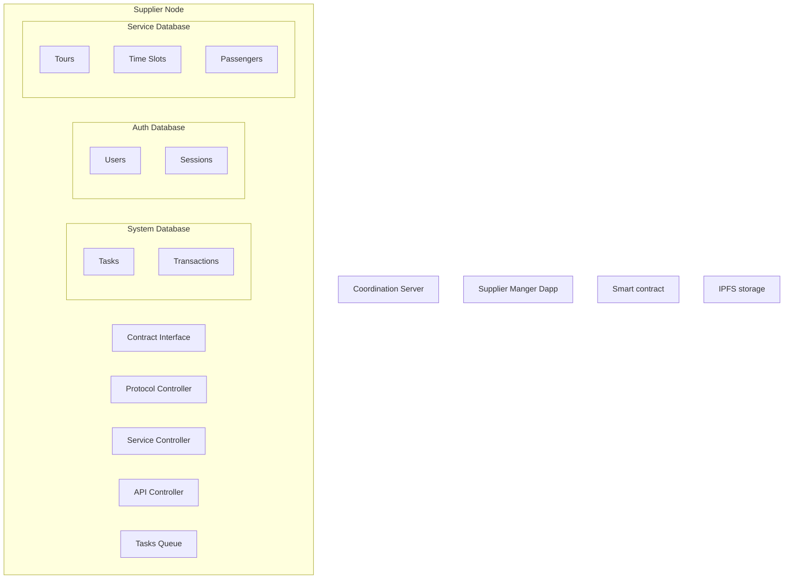
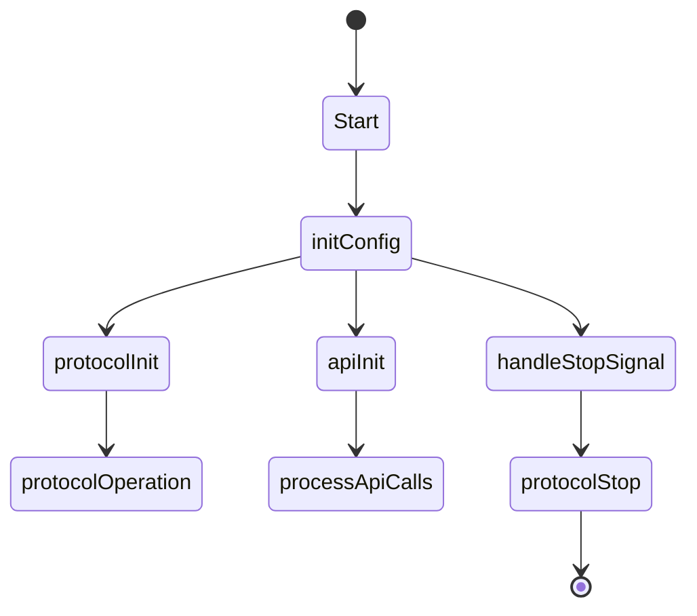
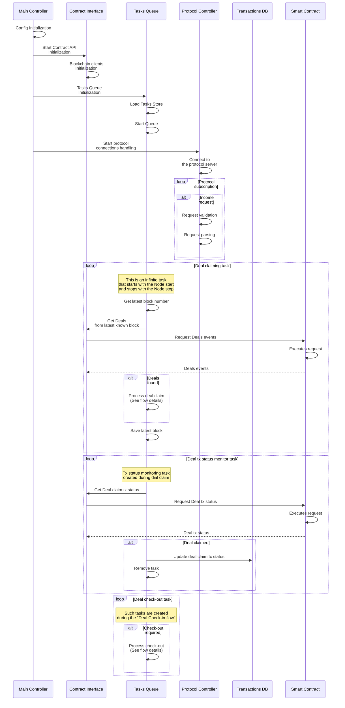
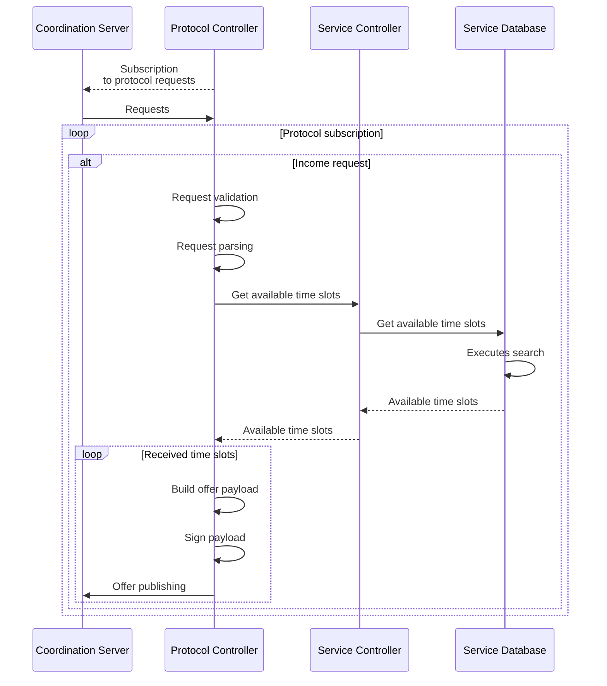
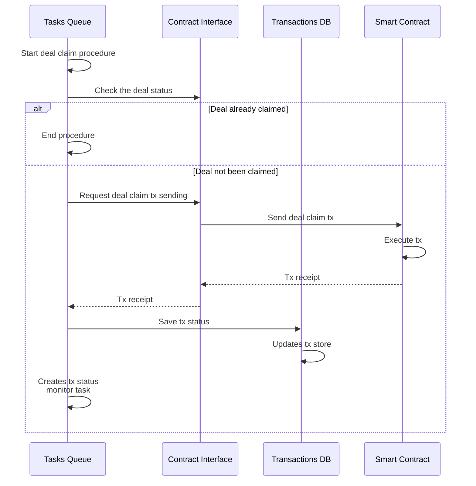

# WindingTree Market Protocol Supplier Node Specification

## Introduction

### Overview

### Objectives

## Technical Requirements

### Technology Stack

- Node.js (LTS)
- Typescript
- tRPC
- @windingtree/sdk

## Architecture and Design

### System Architecture

## Use Cases and Algorithms

### Node States

### Protocol Flow

#### Protocol Initialization

#### Offers Flow

#### Deals Claim

> This flow starts during the [Protocol Initialization flow](#protocol-initialization)

#### Deals Check-In

#### Deals Check-Out

### Dapp Auth Flow (Admin)

### Dapp Auth Flow (Manager)

### Customer Check-In Flow

### Customer Check-Out Flow

### Refund Flow

## API and Integration

### External API Interfaces

### Integration Overview

## Security

### Overview of Security Features

## Development and Deployment

### Development Guidelines

### Deployment Process
